# Student Wellness Companion — Architecture Document

**Version:** 1.0  
**Date:** August 2026  
**Status:** Approved for Implementation  
**Source of Truth:** [PROJECT_VISION.md](file:///d:/miniproject/Wellvia/PROJECT_VISION.md)

---

## Table of Contents

1. [Architecture Overview](#1-architecture-overview)
2. [Architectural Style](#2-architectural-style)
3. [High-Level System Architecture](#3-high-level-system-architecture)
4. [Component Architecture](#4-component-architecture)
5. [Student Architecture](#5-student-architecture)
6. [Admin Architecture](#6-admin-architecture)
7. [Authentication and Authorization Architecture](#7-authentication-and-authorization-architecture)
8. [Data Flow Architecture](#8-data-flow-architecture)
9. [Database Architecture](#9-database-architecture)
10. [Analytics Architecture](#10-analytics-architecture)
11. [Wellness Score Architecture](#11-wellness-score-architecture)
12. [Gamification Architecture](#12-gamification-architecture)
13. [Privacy and Security Architecture](#13-privacy-and-security-architecture)
14. [API / Backend Communication](#14-api--backend-communication)
15. [External Dependencies](#15-external-dependencies)
16. [Deployment Architecture](#16-deployment-architecture)
17. [Scalability Considerations](#17-scalability-considerations)
18. [Architectural Decisions](#18-architectural-decisions)
19. [Architectural Assumptions](#19-architectural-assumptions)
20. [Architectural Constraints](#20-architectural-constraints)
21. [Future Architecture Evolution](#21-future-architecture-evolution)
22. [Architecture Summary](#22-architecture-summary)

---

## 1. Architecture Overview

The Student Wellness Companion follows a **three-layer (layered) architecture** — a well-established pattern that separates the application into distinct tiers based on responsibility. This separation ensures that changes to the user interface do not ripple into business logic, and changes to the database do not force modifications across the entire application.

The three layers are:

```text
┌─────────────────────────────────────────────┐
│          Presentation Layer                 │
│   HTML5 · CSS3 · Bootstrap 5 · Chart.js     │
│   Jinja2 Templates · JavaScript             │
├─────────────────────────────────────────────┤
│          Application Layer                  │
│   Flask Routes · Authentication · RBAC      │
│   Business Logic · Wellness Score Engine    │
│   Gamification Engine · Analytics Engine    │
├─────────────────────────────────────────────┤
│          Data Access Layer                  │
│   PyMySQL · Parameterized Queries           │
│   Pandas (Data Processing)                  │
├─────────────────────────────────────────────┤
│          MySQL Database                     │
│   Users · WellnessRecords · Journals        │
│   Tips · Challenges · Achievements          │
└─────────────────────────────────────────────┘
```

### Why This Architecture Is Appropriate

| Criterion | Rationale |
|-----------|-----------|
| **Simplicity** | A layered architecture is straightforward to understand, implement, and debug — ideal for a BCA-level academic project. |
| **Separation of Concerns** | Each layer has a single, well-defined responsibility. Templates handle display, Flask handles logic, and the database handles persistence. |
| **Testability** | Business logic can be tested independently of the UI and database layers. |
| **Maintainability** | Adding a new wellness metric or modifying the score formula only requires changes in the relevant layer, not across the entire codebase. |
| **Learning Value** | Students gain hands-on experience with a real-world architectural pattern used extensively in professional software development. |

The architecture intentionally avoids enterprise patterns like microservices, message queues, or containerized deployments. These would add complexity without proportional benefit at the current project scale.

---

## 2. Architectural Style

The Student Wellness Companion uses a **three-layer architecture** with **server-side rendering**. Flask serves as both the web server and application framework, rendering HTML pages on the server using Jinja2 templates and delivering fully composed pages to the browser.

### 2.1 Presentation Layer

The Presentation Layer is responsible for everything the user sees and interacts with in the browser.

**Responsibilities:**

- Rendering HTML pages via Jinja2 templates
- Applying styling and responsive layout using CSS3 and Bootstrap 5
- Client-side form validation using JavaScript (supplementing server-side validation)
- Interactive data visualization using Chart.js (line charts, bar charts, pie charts, donut charts)
- Displaying the Student Dashboard with real-time wellness data, streaks, tips, and challenges
- Displaying the Admin Dashboard with aggregated analytics and management tools
- Providing navigation, form inputs, and interactive UI components

**Boundaries:**

- The Presentation Layer does **not** contain business logic, database queries, or authentication decisions.
- All form submissions are sent to Flask routes for server-side processing.
- Chart.js receives pre-processed data from the backend via Jinja2 template variables or embedded JSON.

### 2.2 Application Layer

The Application Layer contains all server-side logic, acting as the brain of the application.

**Responsibilities:**

- **Routing:** Mapping HTTP requests to handler functions via Flask routes
- **Authentication:** Verifying user identity during login, managing sessions, hashing passwords using Werkzeug (bcrypt)
- **Authorization:** Enforcing role-based access control (RBAC) — determining whether a Student or Administrator can access a given route
- **Business Logic:**
  - Wellness score calculation from daily inputs
  - Streak computation for consecutive daily habits
  - Points awarding for completed wellness activities
  - Badge and achievement eligibility checks
  - Challenge progress tracking
- **Validation:** Server-side validation of all form inputs before database writes
- **Analytics Processing:** Aggregating wellness data using Pandas for chart generation and admin analytics
- **Template Rendering:** Passing processed data to Jinja2 templates for page composition

**Boundaries:**

- The Application Layer does **not** directly render HTML or execute client-side JavaScript.
- Database access is performed through parameterized queries via PyMySQL or through a thin data access abstraction within this layer.
- Business rules (e.g., "a streak resets if a day is missed") are implemented here, not in the database or frontend.

### 2.3 Data Access Layer

The Data Access Layer manages all interactions with the MySQL database and handles data processing.

**Responsibilities:**

- **CRUD Operations:** Creating, reading, updating, and deleting records across all database tables
- **Query Construction:** Building parameterized SQL queries to prevent injection attacks
- **Connection Management:** Managing database connections via PyMySQL
- **Data Processing:** Using Pandas for aggregation, trend computation, and analytics preparation
- **Data Integrity:** Enforcing foreign key relationships, unique constraints, and data types at the database level

**Entities Managed:**

| Entity | Description |
|--------|-------------|
| Users | Student and administrator accounts |
| WellnessRecords | Daily wellness data (sleep, hydration, exercise, mood, stress, study) |
| JournalEntries | Private gratitude journal entries |
| WellnessTips | Admin-curated wellness tips |
| Challenges | Admin-created wellness challenges |
| ChallengeProgress | Student participation and completion tracking |
| Achievements | Badge and achievement definitions |
| UserAchievements | Junction table linking students to earned achievements |

**Boundaries:**

- The Data Access Layer does **not** enforce business rules (e.g., point values, score formulas). It stores and retrieves data as directed by the Application Layer.
- Aggregation for analytics may occur in SQL queries or in Pandas, depending on complexity. Simple counts and averages use SQL; multi-dimensional trend analysis uses Pandas.

---

## 3. High-Level System Architecture

The following diagram shows how the major system components connect and communicate:

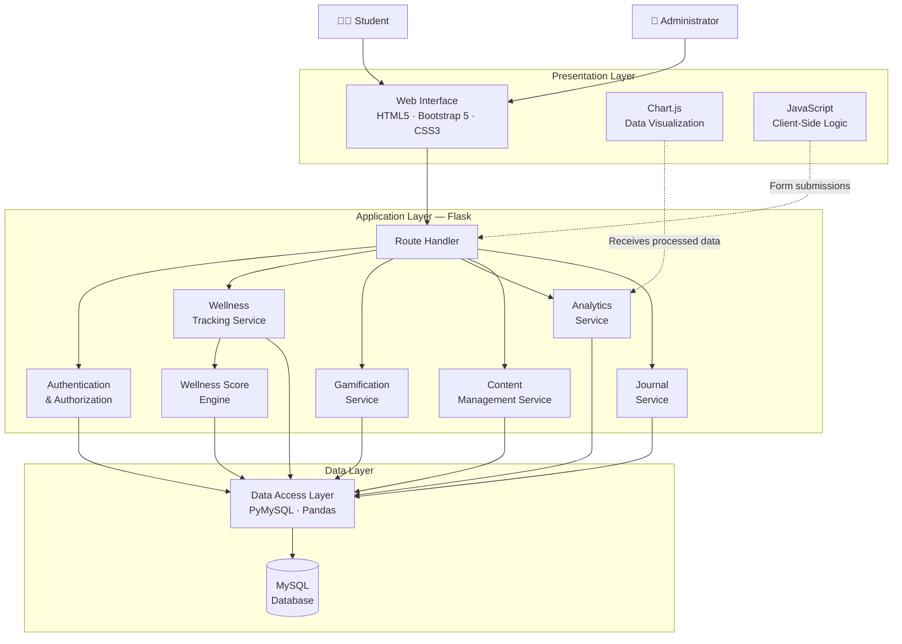

### Diagram Explanation

1. **Students and Administrators** interact with the system through the same **Web Interface**, but see different dashboards and have different permissions.
2. The **Route Handler** in Flask receives all HTTP requests and delegates to the appropriate service based on the URL and HTTP method.
3. **Authentication & Authorization** is consulted on every request to verify identity and enforce role-based access.
4. **Service modules** (Wellness, Gamification, Analytics, Content, Journal) encapsulate domain-specific business logic.
5. The **Wellness Score Engine** is a dedicated calculation module invoked by the Wellness Tracking Service.
6. All services access the database through the **Data Access Layer**, which uses PyMySQL for queries and Pandas for complex aggregation.
7. **Chart.js** in the Presentation Layer receives pre-processed data from the Analytics Service, rendered into template variables by Flask.

---

## 4. Component Architecture

### 4.1 Frontend Components

```mermaid
flowchart LR
    subgraph Frontend["Frontend Components"]
        AuthUI["Authentication UI<br/>Login · Register · Logout"]
        StudentDash["Student Dashboard<br/>Score · Streaks · Tips"]
        WellnessForms["Wellness Tracking Forms<br/>Sleep · Water · Exercise<br/>Mood · Stress · Study"]
        JournalUI["Journal UI<br/>Create · View · Edit · Delete"]
        TipsUI["Wellness Tips Browser<br/>Category Filtering"]
        ChallengeUI["Challenge UI<br/>Active Challenges · Progress"]
        ProgressUI["Progress & Analytics UI<br/>Charts · Trends · Insights"]
        AdminDash["Admin Dashboard<br/>Aggregated Analytics"]
        ContentMgmt["Content Management UI<br/>Tips CRUD · Challenge CRUD"]
        UserMgmt["User Management UI<br/>Account List · Activate/Deactivate"]
    end
```

#### Authentication UI

| Attribute | Detail |
|-----------|--------|
| **Purpose** | Enable students to register, log in, and log out securely |
| **Responsibilities** | Render registration and login forms; display validation errors; handle logout confirmation |
| **Inputs** | Username, email, password (registration); username/email and password (login) |
| **Outputs** | Redirect to Student Dashboard on success; error messages on failure |
| **Dependencies** | Authentication Module (backend) |

#### Student Dashboard

| Attribute | Detail |
|-----------|--------|
| **Purpose** | Central hub displaying the student's current wellness snapshot |
| **Responsibilities** | Display today's wellness score, tracked activities, habit streaks, recent mood, hydration progress, sleep/exercise summary, daily tip, active challenge, and journal shortcut |
| **Inputs** | Pre-processed data from the Application Layer (today's records, scores, streaks, tip of the day, active challenge) |
| **Outputs** | Rendered dashboard page with interactive widgets |
| **Dependencies** | Wellness Tracking Module, Gamification Module, Content Management Module, Analytics Module |

#### Wellness Tracking Forms

| Attribute | Detail |
|-----------|--------|
| **Purpose** | Allow students to log daily wellness data across six categories |
| **Responsibilities** | Render input forms for sleep (hours, quality), hydration (glasses), exercise (type, duration, intensity), mood (1–5 scale), stress (1–5 scale), and study (hours, sessions, subject). Perform client-side validation before submission. |
| **Inputs** | User-entered wellness data |
| **Outputs** | POST request to Flask backend; updated dashboard on success |
| **Dependencies** | Wellness Tracking Module (backend), Bootstrap form components |

#### Journal UI

| Attribute | Detail |
|-----------|--------|
| **Purpose** | Provide a private journaling interface for gratitude and reflection |
| **Responsibilities** | Render journal entry form, display chronological list of past entries, enable edit and delete operations |
| **Inputs** | Free-text journal content |
| **Outputs** | CRUD operations on journal entries; rendered journal history |
| **Dependencies** | Journal Module (backend) |

#### Wellness Tips UI

| Attribute | Detail |
|-----------|--------|
| **Purpose** | Display curated wellness tips with optional category filtering |
| **Responsibilities** | Render tips list, support filtering by category (sleep, hydration, exercise, stress, study, general) |
| **Inputs** | Tip data from backend |
| **Outputs** | Filtered, paginated tip display |
| **Dependencies** | Content Management Module (backend) |

#### Challenge UI

| Attribute | Detail |
|-----------|--------|
| **Purpose** | Display active challenges and allow students to participate and track progress |
| **Responsibilities** | Show daily/weekly challenges, display completion status, allow marking challenges as completed |
| **Inputs** | Challenge definitions and progress data from backend |
| **Outputs** | Challenge participation actions; updated progress display |
| **Dependencies** | Challenge Module, Gamification Module (backend) |

#### Progress & Analytics UI

| Attribute | Detail |
|-----------|--------|
| **Purpose** | Visualize personal wellness trends using interactive charts |
| **Responsibilities** | Render Chart.js charts for sleep trends, hydration progress, exercise frequency, mood/stress trends, study hours, wellness score history, and habit completion percentages |
| **Inputs** | Pre-aggregated chart data (JSON) from the Analytics Module |
| **Outputs** | Interactive line, bar, pie, and donut charts |
| **Dependencies** | Analytics Module (backend), Chart.js library |

#### Admin Dashboard

| Attribute | Detail |
|-----------|--------|
| **Purpose** | Provide administrators with an overview of aggregated, anonymized student wellness statistics |
| **Responsibilities** | Display summary statistics (average sleep, hydration, mood distribution, stress distribution, study hours, challenge participation) using charts and tables |
| **Inputs** | Aggregated analytics data from the Admin Module |
| **Outputs** | Anonymized charts and summary statistics |
| **Dependencies** | Analytics Module, Admin Module (backend) |

#### Content Management UI

| Attribute | Detail |
|-----------|--------|
| **Purpose** | Enable administrators to manage wellness tips and challenges |
| **Responsibilities** | CRUD operations for tips (add, edit, delete, categorize) and challenges (create, edit, retire, set points/duration) |
| **Inputs** | Admin-entered content data |
| **Outputs** | Updated tips and challenges in the database |
| **Dependencies** | Content Management Module (backend) |

#### User Management UI

| Attribute | Detail |
|-----------|--------|
| **Purpose** | Enable administrators to view and manage student accounts |
| **Responsibilities** | Display registered user list with basic info (username, email, registration date, status); support account activation/deactivation and password reset |
| **Inputs** | User list and admin actions |
| **Outputs** | Updated account statuses |
| **Dependencies** | User Management Module (backend) |

---

### 4.2 Backend Components

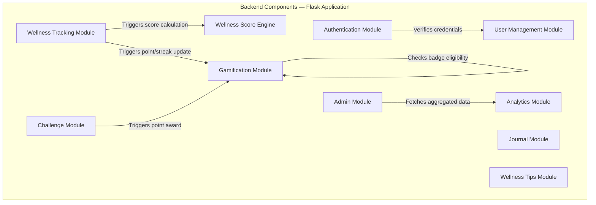

#### Authentication Module

| Attribute | Detail |
|-----------|--------|
| **Purpose** | Manage user identity verification and session lifecycle |
| **Responsibilities** | Handle registration (input validation, duplicate checks, password hashing); handle login (credential verification, session creation); handle logout (session destruction); enforce password complexity rules |
| **Inputs** | Registration data, login credentials, logout requests |
| **Outputs** | Authenticated session, error messages, redirect responses |
| **Dependencies** | User Management Module, Werkzeug (password hashing), Flask session |

#### User Management Module

| Attribute | Detail |
|-----------|--------|
| **Purpose** | Manage user records and profiles |
| **Responsibilities** | Create new user records; retrieve user profiles; update profile information; activate/deactivate accounts; list users for admin views |
| **Inputs** | User data from registration, admin actions |
| **Outputs** | User records, profile data, account status updates |
| **Dependencies** | Data Access Layer (MySQL) |

#### Wellness Tracking Module

| Attribute | Detail |
|-----------|--------|
| **Purpose** | Process and store daily wellness data entries |
| **Responsibilities** | Validate wellness inputs (range checks, data types); create or update daily wellness records; invoke the Wellness Score Engine after each entry; trigger gamification updates (points, streaks) |
| **Inputs** | Wellness form data (sleep, hydration, exercise, mood, stress, study) |
| **Outputs** | Stored wellness record, calculated wellness score, gamification triggers |
| **Dependencies** | Wellness Score Engine, Gamification Module, Data Access Layer |

#### Journal Module

| Attribute | Detail |
|-----------|--------|
| **Purpose** | Manage private gratitude journal entries |
| **Responsibilities** | Create, read, update, and delete journal entries; enforce ownership — only the author can access their entries; provide chronological journal history |
| **Inputs** | Journal content, entry ID (for edit/delete), authenticated user ID |
| **Outputs** | Stored journal entry, journal history list |
| **Dependencies** | Authentication Module (ownership verification), Data Access Layer |

#### Wellness Tips Module

| Attribute | Detail |
|-----------|--------|
| **Purpose** | Serve curated wellness tips to students |
| **Responsibilities** | Retrieve active tips from the database; support filtering by category; select a daily tip for dashboard rotation |
| **Inputs** | Category filter, request for daily tip |
| **Outputs** | List of tips, single daily tip |
| **Dependencies** | Data Access Layer |

#### Challenge Module

| Attribute | Detail |
|-----------|--------|
| **Purpose** | Manage wellness challenges and student participation |
| **Responsibilities** | Retrieve active challenges; track student participation (start, progress, completion); mark challenges as completed; trigger gamification rewards on completion |
| **Inputs** | Challenge ID, student actions (join, complete) |
| **Outputs** | Challenge list, participation status, completion triggers |
| **Dependencies** | Gamification Module, Data Access Layer |

#### Gamification Module

| Attribute | Detail |
|-----------|--------|
| **Purpose** | Manage all gamification mechanics — points, streaks, badges, and achievements |
| **Responsibilities** | Award points based on the defined point table; calculate and update habit streaks (increment on consecutive days, reset on missed days); check achievement/badge eligibility after each relevant action; record earned achievements in the database |
| **Inputs** | Wellness activity events, challenge completion events |
| **Outputs** | Updated point totals, streak counts, newly earned badges |
| **Dependencies** | Data Access Layer |

#### Analytics Module

| Attribute | Detail |
|-----------|--------|
| **Purpose** | Process wellness data for visualization and insights |
| **Responsibilities** | Aggregate student-specific data for personal charts (weekly, monthly trends); aggregate anonymized data for admin analytics; compute averages, distributions, and trend lines using Pandas; generate simple pattern-based observations from student data |
| **Inputs** | Raw wellness records from the database |
| **Outputs** | Processed chart data (JSON-compatible), summary statistics, textual insights |
| **Dependencies** | Data Access Layer, Pandas |

#### Admin Module

| Attribute | Detail |
|-----------|--------|
| **Purpose** | Coordinate all administrator-specific functionality |
| **Responsibilities** | Serve the admin dashboard; delegate to User Management, Content Management, and Analytics modules; enforce admin-only access on all administrative routes |
| **Inputs** | Admin HTTP requests |
| **Outputs** | Admin dashboard pages, management action responses |
| **Dependencies** | User Management Module, Wellness Tips Module, Challenge Module, Analytics Module |

#### Wellness Score Engine

| Attribute | Detail |
|-----------|--------|
| **Purpose** | Calculate the daily wellness score from logged inputs |
| **Responsibilities** | Normalize raw wellness values to a 0–100 sub-score per component; apply weighted formula; handle missing data gracefully; return a composite score |
| **Inputs** | Daily wellness record (sleep, hydration, exercise, mood, stress, study balance) |
| **Outputs** | Wellness score (integer, 0–100) |
| **Dependencies** | None (pure calculation module) |

---

### 4.3 Database Components

The database consists of seven core entities and one junction table. Detailed schema design is documented in `SYSTEM_DESIGN.md`; this section describes entities at the architectural level.

| Entity | Purpose | Key Relationships |
|--------|---------|-------------------|
| **Users** | Stores all user accounts (students and administrators) | One-to-many with WellnessRecords, JournalEntries, ChallengeProgress, UserAchievements |
| **WellnessRecords** | Consolidated daily wellness data per student | Many-to-one with Users |
| **JournalEntries** | Private gratitude journal entries | Many-to-one with Users |
| **WellnessTips** | Admin-curated wellness advice | Standalone (no FK relationships) |
| **Challenges** | Admin-created wellness challenges | One-to-many with ChallengeProgress |
| **ChallengeProgress** | Tracks student participation in challenges | Many-to-one with Users and Challenges |
| **Achievements** | Badge and milestone definitions | One-to-many with UserAchievements |
| **UserAchievements** | Records earned badges per student | Many-to-one with Users and Achievements |

---

## 5. Student Architecture

The student experience follows a clearly defined flow from authentication to personalized interaction:

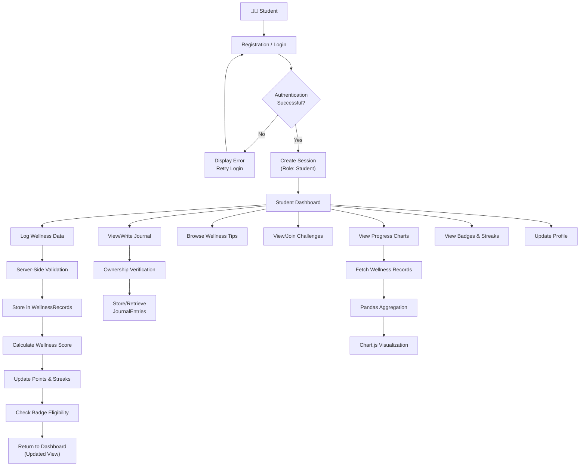

### Complete Student Flow

1. **Entry:** The student navigates to the application URL and reaches the login/registration page.
2. **Authentication:** The student registers (first time) or logs in with existing credentials. Passwords are verified against stored bcrypt hashes. On success, a server-side session is created with the student's user ID and role.
3. **Dashboard:** The student is redirected to their personalized dashboard, which loads today's wellness data, current streaks, wellness score, a daily tip, and any active challenges.
4. **Wellness Logging:** The student fills out wellness forms (sleep, hydration, exercise, mood, stress, study). Data is validated server-side, stored in the `WellnessRecords` table, and the wellness score is recalculated.
5. **Gamification Triggers:** After logging, the system awards points, updates streak counts, and checks whether any badge criteria have been met. New badges are recorded in `UserAchievements`.
6. **Journaling:** The student writes gratitude entries. Each entry is tied to the student's user ID. Only the owning student can view, edit, or delete their entries.
7. **Analytics:** The student visits the progress page. The backend fetches historical wellness records, processes them through Pandas for aggregation, and sends structured data to Chart.js for rendering.
8. **Challenges:** The student views active challenges, joins them, and marks them as completed. Completion triggers point awards and potential badge checks.
9. **Logout:** The student logs out, destroying the server-side session.

---

## 6. Admin Architecture

The administrator experience is separated from the student experience at both the route and data access levels.

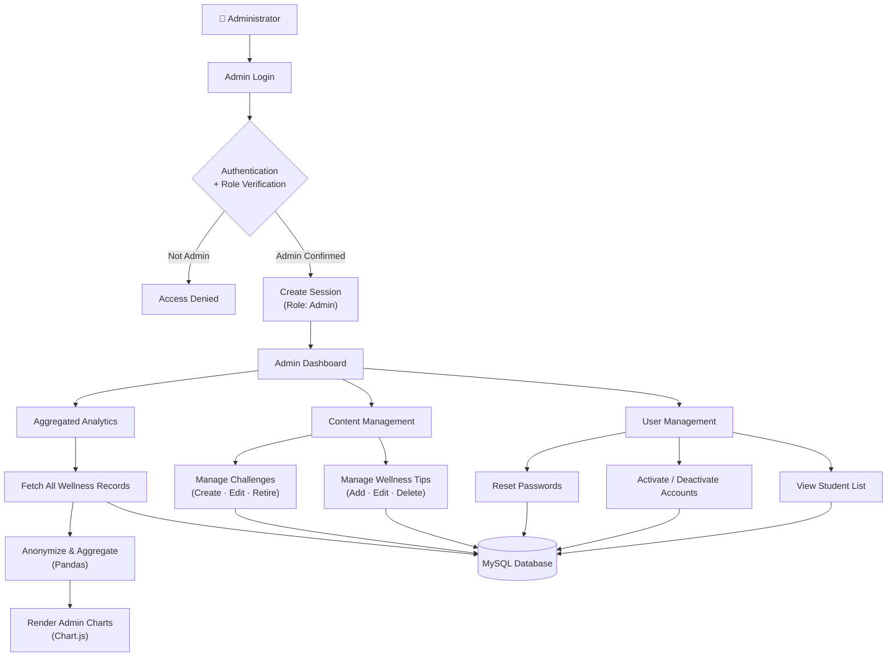

### How Admin Access Is Separated from Student Functionality

| Separation Mechanism | Implementation |
|----------------------|----------------|
| **Role-based routes** | Admin routes are grouped under `/admin/*` and protected by a decorator that checks `session['role'] == 'admin'`. |
| **Separate dashboards** | Students are redirected to `/dashboard`; administrators are redirected to `/admin/dashboard`. The two interfaces are entirely different templates. |
| **No access to private data** | Admin routes query only aggregated data. The admin analytics module uses SQL `GROUP BY` and `AVG`/`COUNT` operations — individual user IDs are not included in the result set sent to the template. |
| **No journal access** | There is no admin route or query that retrieves individual journal entries. |
| **Account management scope** | Admins can view usernames, emails, registration dates, and account status. They cannot view wellness records, mood logs, stress levels, or journal content for individual students. |
| **Pre-created accounts** | Admin accounts are pre-created (seeded during setup), not self-registered. There is no public admin registration route. |

---

## 7. Authentication and Authorization Architecture

### 7.1 Core Concepts

**Authentication** answers the question: *"Who is this user?"*  
It verifies that the person making a request is who they claim to be — through username/email and password verification.

**Authorization** answers the question: *"What is this user allowed to do?"*  
It determines which pages, actions, and data a verified user can access — through role-based access control (RBAC).

### 7.2 Registration Flow

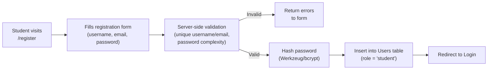

- Passwords are hashed using Werkzeug's `generate_password_hash()` with bcrypt.
- Plaintext passwords are **never** stored or logged.
- Minimum password length and basic complexity rules are enforced.
- Username and email uniqueness is verified before insertion.

### 7.3 Login Flow

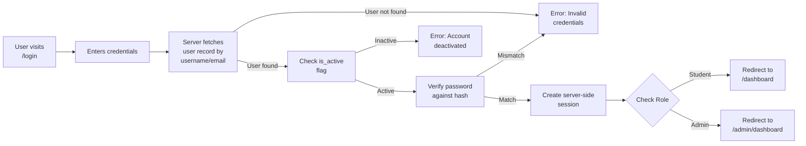

### 7.4 Logout

- The student or admin clicks "Logout."
- The server destroys the session using `session.clear()`.
- The user is redirected to the login page.
- Session cookies are invalidated.

### 7.5 Session Management

| Aspect | Implementation |
|--------|----------------|
| **Session storage** | Server-side using Flask's built-in session mechanism with a secret key |
| **Session data** | User ID, username, role (student/admin) |
| **Cookie flags** | `HttpOnly` (prevent JavaScript access), `Secure` (HTTPS only in production) |
| **Session timeout** | Configurable inactivity timeout (e.g., 30 minutes). **Architectural Assumption.** |
| **Session regeneration** | Session ID is regenerated on login to prevent session fixation |

### 7.6 Role-Based Access Control (RBAC)

The system defines exactly two roles:

| Role | Description | Access Scope |
|------|-------------|--------------|
| **Student** | Primary user who tracks wellness, journals, and participates in challenges | All student routes (`/dashboard`, `/wellness`, `/journal`, `/tips`, `/challenges`, `/progress`, `/profile`) |
| **Admin** | Campus wellness coordinator who manages content and views aggregated analytics | All admin routes (`/admin/dashboard`, `/admin/users`, `/admin/tips`, `/admin/challenges`, `/admin/analytics`) |

**Protected Route Implementation:**

Flask route decorators are used to enforce access control:

```text
@login_required          → Ensures the user is authenticated (has an active session)
@student_required        → Ensures the authenticated user has role = 'student'
@admin_required          → Ensures the authenticated user has role = 'admin'
```

**Unauthorized Access Handling:**

- Unauthenticated users attempting to access any protected route are redirected to `/login`.
- Authenticated students attempting to access admin routes receive a 403 Forbidden response or are redirected to their own dashboard.
- Authenticated admins attempting to access student-specific routes (e.g., journal) receive a 403 Forbidden response.

---

## 8. Data Flow Architecture

### 8.1 Wellness Entry Flow

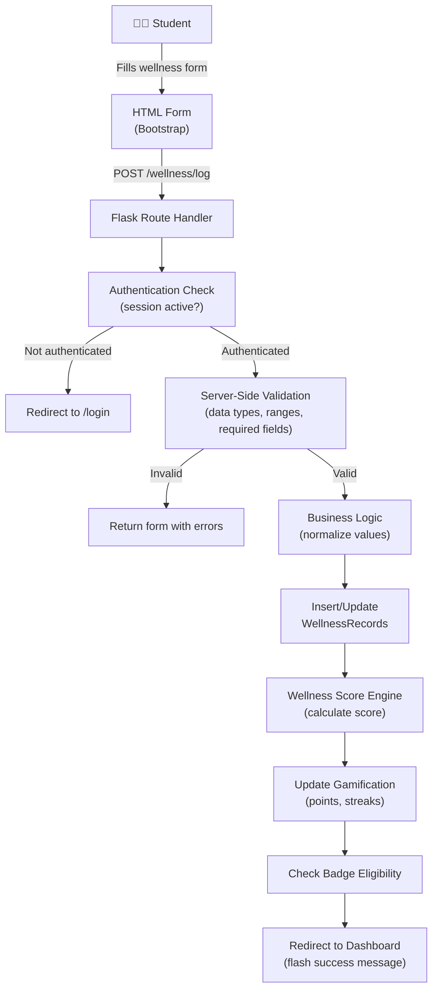

**Detailed flow:**

1. The student fills out the wellness tracking form with today's data.
2. The form submits a POST request to the Flask backend.
3. The route handler checks that the user has an active session.
4. All inputs are validated server-side: data types are checked, numeric values are range-validated (e.g., sleep hours 0–24, mood 1–5, stress 1–5), and required fields are confirmed.
5. Validated data is normalized and written to the `WellnessRecords` table. If a record already exists for today, it is updated rather than duplicated.
6. The Wellness Score Engine calculates the day's score from all available inputs.
7. The Gamification Module awards points, updates streaks, and checks for newly earned badges.
8. The student is redirected back to the dashboard with updated data.

### 8.2 Journal Entry Flow

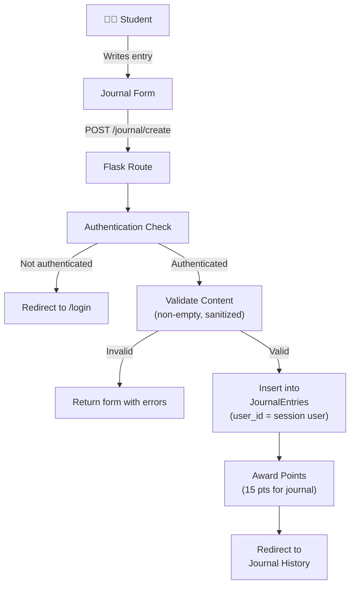

**Privacy enforcement:**

- On **create**: The `user_id` is always set from the server-side session, not from form data.
- On **read/edit/delete**: The query includes `WHERE user_id = :session_user_id AND entry_id = :entry_id`, ensuring that only the owning student can access the entry. If no matching record is found, a 403/404 response is returned.

### 8.3 Analytics Data Flow

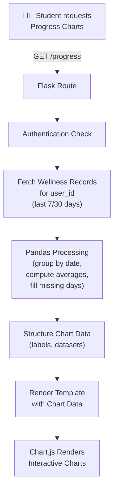

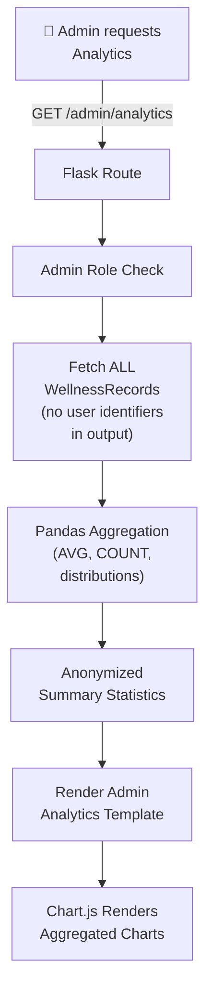

**Key difference:** Student analytics queries include `WHERE user_id = :current_user`. Admin analytics queries use aggregate functions (`AVG`, `COUNT`, `GROUP BY date`) **without** including `user_id` in the `SELECT` or output — ensuring anonymity.

### 8.4 Admin Content Management Flow

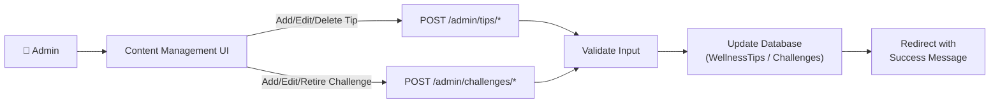

---

## 9. Database Architecture

### 9.1 Entity-Relationship Diagram

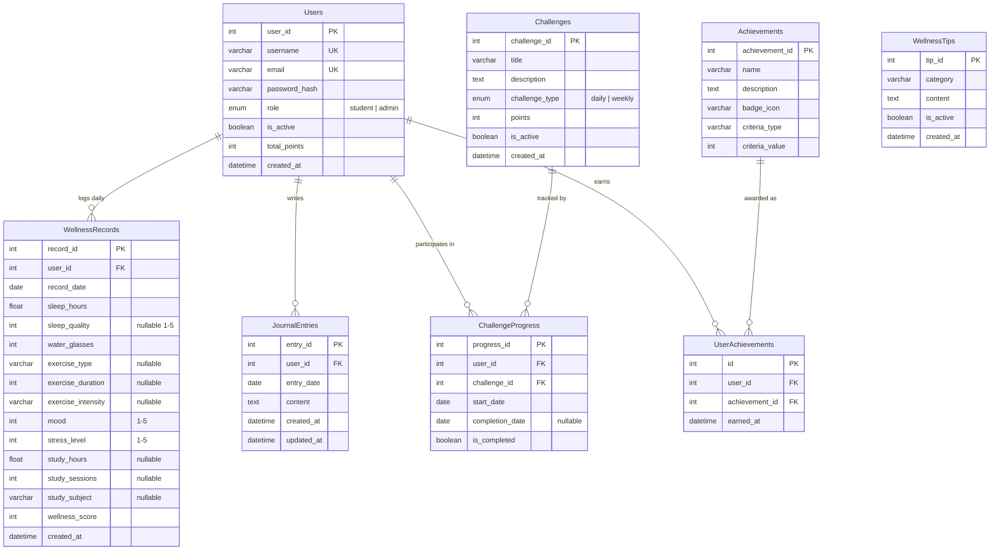

### 9.2 Relationships Summary

| Relationship | Type | Description |
|--------------|------|-------------|
| Users → WellnessRecords | One-to-Many | Each student has multiple daily wellness records. |
| Users → JournalEntries | One-to-Many | Each student has multiple journal entries. |
| Users → ChallengeProgress | One-to-Many | Each student can participate in multiple challenges. |
| Users → UserAchievements | One-to-Many | Each student can earn multiple achievements. |
| Challenges → ChallengeProgress | One-to-Many | Each challenge can be attempted by multiple students. |
| Achievements → UserAchievements | One-to-Many | Each achievement can be earned by multiple students. |
| Users ↔ Challenges | Many-to-Many | Resolved through the ChallengeProgress junction table. |
| Users ↔ Achievements | Many-to-Many | Resolved through the UserAchievements junction table. |

### 9.3 Design Decisions

**Consolidated WellnessRecords Table:**

As documented in the Project Vision, a single `WellnessRecords` table is used instead of separate tables for sleep, hydration, exercise, mood, stress, and study. This decision is based on:

1. **Reduced query complexity** — Dashboard queries retrieve all daily metrics in a single `SELECT` without joins.
2. **Practical scope** — The set of tracked wellness metrics is fixed and known. A normalized design with separate tables would be justified only if custom, user-defined metrics were supported.
3. **Simpler application code** — One insert/update operation per day instead of coordinating writes across multiple tables.

Optional fields (sleep quality, exercise intensity, study subject) are nullable, allowing partial daily entries.

### 9.4 Data Ownership

| Data Type | Owner | Accessible By |
|-----------|-------|---------------|
| Wellness records | Individual student | The student only; aggregated (anonymized) views available to admins |
| Journal entries | Individual student | The student only; **no** admin access |
| Profile information | Individual student | The student; limited admin access (username, email, status) |
| Wellness tips | System (admin-managed) | All users (read); admins (write) |
| Challenges | System (admin-managed) | All students (read/participate); admins (write) |
| Achievement definitions | System | All users (read) |
| Earned achievements | Individual student | The student only |
| Challenge progress | Individual student | The student only |

### 9.5 Indexing Strategy

**Architectural Assumption:** The following indexes are recommended for query performance. Exact indexing will be defined in `SYSTEM_DESIGN.md`.

| Table | Indexed Columns | Rationale |
|-------|-----------------|-----------|
| WellnessRecords | `(user_id, record_date)` | Dashboard queries filter by user and date |
| JournalEntries | `(user_id, entry_date)` | Journal retrieval filtered by user |
| ChallengeProgress | `(user_id, challenge_id)` | Progress lookups per user per challenge |
| UserAchievements | `(user_id)` | Badge display queries |
| Users | `(username)`, `(email)` | Login lookups |

---

## 10. Analytics Architecture

The analytics system operates at two distinct levels with strict data separation between them.

### 10.1 Student Analytics (Personal)

Student analytics are scoped exclusively to the authenticated student's own data.

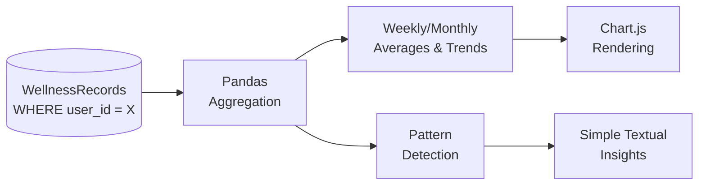

**Available student analytics:**

| Metric | Chart Type | Time Range |
|--------|-----------|------------|
| Sleep hours trend | Bar chart | Weekly / Monthly |
| Hydration progress | Bar chart with target line | Daily / Weekly |
| Exercise trend | Bar chart (frequency & duration) | 4-week rolling |
| Mood trend | Line chart | Weekly / Monthly |
| Stress trend | Line chart | Weekly / Monthly |
| Study hours distribution | Bar chart | Weekly / Monthly |
| Wellness score history | Line chart | Weekly / Monthly |
| Habit completion rate | Donut chart | Monthly |

**Pattern-based observations:**

The system generates simple, data-driven observations by comparing averages across conditions. Examples:

- *"Your average stress level was lower on days when you recorded at least 7 hours of sleep."*
- *"Your mood was generally higher during weeks when you maintained your hydration streak."*

These observations are computed in the Application Layer using straightforward conditional logic (e.g., `avg(stress) WHERE sleep_hours >= 7` vs. `avg(stress) WHERE sleep_hours < 7`). They are **not** clinical assessments or AI predictions.

### 10.2 Admin Analytics (Aggregated)

Admin analytics present anonymized, aggregate data. Individual student identities are **never** included in the query results sent to the admin dashboard.

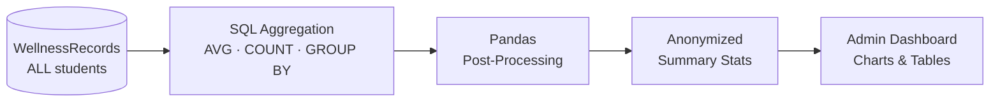

**Available admin analytics:**

| Metric | Computation | Privacy Safeguard |
|--------|-------------|-------------------|
| Average sleep duration | `AVG(sleep_hours) GROUP BY record_date` | No user identifiers in output |
| Average hydration | `AVG(water_glasses) GROUP BY record_date` | No user identifiers in output |
| Mood distribution | `COUNT(*) GROUP BY mood` | Percentage-based distribution |
| Stress distribution | `COUNT(*) GROUP BY stress_level` | Percentage-based distribution |
| Average study hours | `AVG(study_hours) GROUP BY record_date` | No user identifiers in output |
| Challenge participation | `COUNT(DISTINCT user_id) per challenge` | Only counts, not names |
| Habit completion trends | `COUNT(*) GROUP BY record_date` | Aggregate counts only |

### 10.3 Privacy Boundary

The architecture enforces a strict boundary between personal and aggregate analytics:

- **Student analytics queries** always include `WHERE user_id = :current_user_id`.
- **Admin analytics queries** never include `user_id` in the `SELECT` clause or in the data sent to templates.
- Admin SQL queries use aggregate functions (`AVG`, `COUNT`, `SUM`, `GROUP BY`) to ensure individual records cannot be reconstructed.
- **Architectural Assumption:** If the total number of active students is very small (e.g., fewer than 5), aggregate statistics could still be potentially identifying. In such cases, a minimum threshold before displaying aggregated data should be considered in future versions.

---

## 11. Wellness Score Architecture

### 11.1 Purpose and Disclaimer

The wellness score is an **engagement and self-awareness metric** — a numeric indicator that reflects the consistency and balance of self-reported daily habits. It is presented as a motivational tool.

> **Important:** The wellness score is **not** a medical assessment, psychological evaluation, clinical diagnosis, or health rating. Students should consult qualified healthcare professionals for any health concerns. The application clearly communicates this disclaimer in the user interface.

### 11.2 Score Composition

The wellness score is calculated from six components, each contributing a weighted percentage to a total score out of 100:

| Component | Weight | Ideal Range | Scoring Logic |
|-----------|--------|-------------|---------------|
| Hydration | 20% | 8+ glasses | Score increases linearly up to the target; exceeding the target yields full marks |
| Sleep | 20% | 7–9 hours | Scores highest within the ideal range; significantly lower or higher values score less |
| Exercise | 15% | 30+ minutes | Score based on duration logged; any exercise scores above zero |
| Mood | 15% | 4–5 (Happy/Very Happy) | Directly maps from the 1–5 scale |
| Stress | 15% | 1–2 (Low) | Inverse scoring — lower stress yields higher score |
| Study Balance | 15% | 2–6 hours | Scores highest within a balanced range; extremes (0 or 12+) score lower |

### 11.3 Calculation Architecture

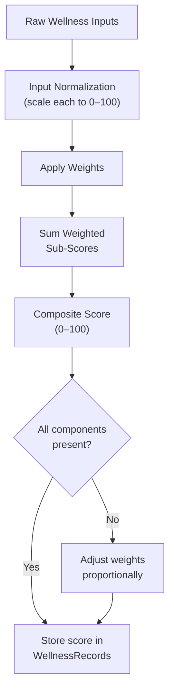

**Input Normalization:**

Each raw value is converted to a 0–100 sub-score using component-specific normalization functions:

```text
Example — Sleep Normalization:
  < 4 hours  →  20/100
  4–5 hours  →  40/100
  5–6 hours  →  60/100
  6–7 hours  →  80/100
  7–9 hours  → 100/100
  9–10 hours →  80/100
  > 10 hours →  60/100

Example — Stress (Inverse) Normalization:
  Stress 1 (Very Low)  → 100/100
  Stress 2 (Low)       →  80/100
  Stress 3 (Moderate)  →  60/100
  Stress 4 (High)      →  40/100
  Stress 5 (Very High) →  20/100
```

**Weighted Calculation:**

```text
Wellness Score = (Hydration_sub × 0.20)
              + (Sleep_sub     × 0.20)
              + (Exercise_sub  × 0.15)
              + (Mood_sub      × 0.15)
              + (Stress_sub    × 0.15)
              + (Study_sub     × 0.15)
```

### 11.4 Missing Data Handling

Students may not log all six categories every day. The architecture handles this as follows:

- If a component is missing, its weight is redistributed proportionally among the components that are present.
- If no components are logged, the wellness score is null/not displayed.
- A minimum of **two components** must be logged for a meaningful score to be calculated. **Architectural Assumption.**

### 11.5 Score Storage

- The calculated wellness score is stored directly in the `wellness_score` column of the `WellnessRecords` table.
- The score is recalculated and updated each time the student logs or modifies wellness data for the current day.
- Historical scores remain stored, enabling trend visualization over time.

---

## 12. Gamification Architecture

The gamification system is designed to sustain engagement through positive reinforcement. All gamification elements are **personal** — there are no public leaderboards or inter-student comparisons.

### 12.1 Gamification Components

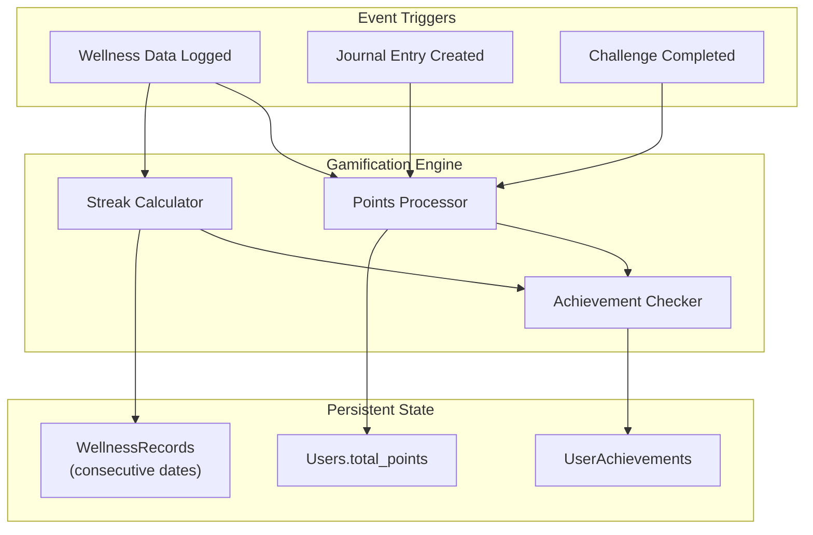

### 12.2 Points System

Points are awarded immediately upon completing an activity:

| Activity | Points |
|----------|--------|
| Log sleep | 10 |
| Log hydration | 10 |
| Log exercise | 15 |
| Record mood | 5 |
| Record stress level | 5 |
| Log study hours | 10 |
| Write a journal entry | 15 |
| Complete a daily challenge | 20 |
| Complete a weekly challenge | 50 |

Points accumulate in the `Users.total_points` column. **Architectural Assumption:** Point values are configurable during development but stored as application constants, not in the database, for simplicity.

### 12.3 Streak Calculation

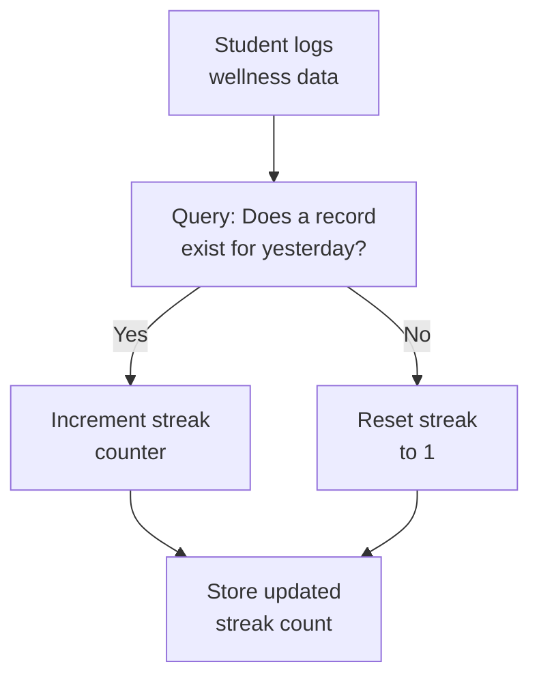

**Implementation approach:**

- Streaks are calculated dynamically by querying `WellnessRecords` for consecutive dates where a specific category was logged.
- **Architectural Assumption:** Streak counts are computed on-the-fly rather than stored in a separate table, keeping the schema simpler. If performance becomes an issue, a cached `UserStreaks` table can be introduced.
- A day is considered "logged" if the corresponding field is not null in the `WellnessRecords` table for that date.

### 12.4 Badges and Achievements

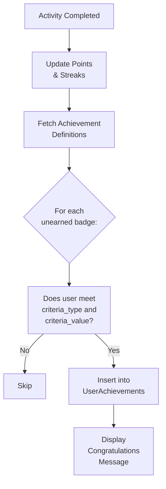

**Badge evaluation:**

- After every points/streak update, the system queries the `Achievements` table for all badges the student has **not yet earned**.
- Each unearned badge's `criteria_type` and `criteria_value` are checked against the student's current data.
- If the criteria are met, a record is inserted into `UserAchievements` with the current timestamp.
- The student sees a notification or badge highlight on their dashboard.

**Example criteria checks:**

| Badge | criteria_type | criteria_value | Check Logic |
|-------|---------------|----------------|-------------|
| 7-Day Streak | `streak` | `7` | Current streak ≥ 7 for any habit |
| Hydration Hero | `hydration_streak` | `7` | 7 consecutive days with water logged |
| Gratitude Starter | `journal_count` | `5` | Total journal entries ≥ 5 |
| Challenge Conqueror | `challenges_completed` | `10` | Total completed challenges ≥ 10 |
| Wellness Explorer | `all_categories_day` | `1` | All 6 categories logged on a single day |

### 12.5 Event-Driven Gamification Flow

```text
Complete Daily Habit
        ↓
Server-Side Validation
        ↓
Store Wellness Record
        ↓
Award Points (+10/15 based on activity)
        ↓
Update Streak Count
        ↓
Check All Unearned Achievements
        ↓
Award New Badges (if criteria met)
        ↓
Update Dashboard (score, points, streaks, badges)
```

---

## 13. Privacy and Security Architecture

### 13.1 Guiding Principle: Least Privilege

The architecture follows the **principle of least privilege** — every user, module, and query is granted only the minimum level of access necessary to perform its function.

| Actor | Minimum Access Required | Denied Access |
|-------|------------------------|---------------|
| Student | Own wellness records, own journal, own achievements, shared tips/challenges | Other students' data, admin functions, aggregated analytics |
| Administrator | User list (basic info), tip/challenge management, aggregated analytics | Individual wellness records, journal entries, student passwords |
| Unauthenticated user | Login page, registration page | All protected routes and data |

### 13.2 Password Security

| Safeguard | Implementation |
|-----------|----------------|
| **Hashing algorithm** | Werkzeug `generate_password_hash()` using bcrypt |
| **Plaintext storage** | Never stored, never logged, never transmitted back to the client |
| **Password complexity** | Minimum length and basic complexity rules enforced during registration |
| **Comparison** | `check_password_hash()` performs constant-time comparison to prevent timing attacks |

### 13.3 Role-Based Access Control

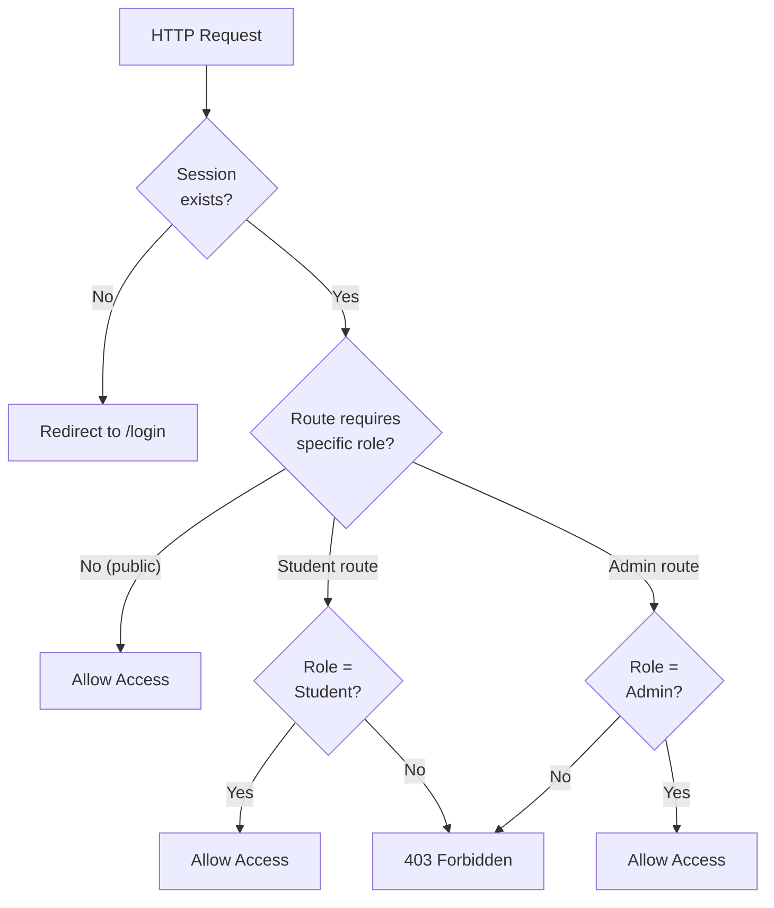

### 13.4 Journal Privacy

- Journal entries are stored with `user_id` as a foreign key.
- Every read, update, and delete query includes `WHERE user_id = :session_user_id`.
- There is **no** admin route, API endpoint, or database view that exposes individual journal entries.
- The `user_id` in the query is always taken from the server-side session, never from request parameters, preventing parameter tampering.

### 13.5 Input Validation and Injection Prevention

| Threat | Mitigation |
|--------|------------|
| **SQL Injection** | All database queries use parameterized statements (`%s` placeholders with PyMySQL). Raw string concatenation in queries is prohibited. |
| **Cross-Site Scripting (XSS)** | Jinja2 auto-escapes template variables by default. User-generated content is rendered through `{{ variable }}` which escapes HTML entities. |
| **Invalid Data** | All form inputs are validated server-side for data type, range, and format before database writes. Client-side validation supplements but does not replace server-side checks. |
| **Mass Assignment** | Only explicitly expected form fields are extracted from request data. Unexpected fields are ignored. |

### 13.6 Session Security

| Safeguard | Detail |
|-----------|--------|
| **Secret key** | Flask's `SECRET_KEY` is set to a strong, random value. Not hardcoded in source code for production. **Architectural Assumption.** |
| **HttpOnly cookies** | Session cookies are marked `HttpOnly` to prevent JavaScript access. |
| **Secure flag** | In production, cookies are marked `Secure` to ensure HTTPS-only transmission. |
| **Inactivity timeout** | Sessions expire after a configurable period of inactivity. |
| **Session fixation prevention** | Session ID is regenerated upon successful login. |

### 13.7 Aggregated Admin Analytics

- Admin analytics queries use SQL aggregate functions (`AVG`, `COUNT`, `SUM`, `GROUP BY`).
- `user_id` is **not** included in `SELECT` clauses of admin analytics queries.
- The admin interface displays distributions, averages, and trends — never individual data points.
- **Architectural Assumption:** Access logging records administrative actions (account changes, content modifications) for accountability.

---

## 14. API / Backend Communication

The Student Wellness Companion uses **server-side rendering** via Flask and Jinja2. Pages are composed on the server and delivered as complete HTML to the browser. This means the application does not expose a formal REST API in its initial version.

However, communication between the browser and Flask follows RESTful conventions:

### 14.1 Route Groups

| Route Group | Base Path | Purpose | Access |
|-------------|-----------|---------|--------|
| **Auth** | `/auth/*` | Registration, login, logout | Public (login/register); Authenticated (logout) |
| **Dashboard** | `/dashboard` | Student dashboard | Student |
| **Wellness** | `/wellness/*` | Log and view wellness data | Student |
| **Journal** | `/journal/*` | CRUD for journal entries | Student |
| **Tips** | `/tips/*` | Browse wellness tips | Student |
| **Challenges** | `/challenges/*` | View and participate in challenges | Student |
| **Progress** | `/progress/*` | View charts and analytics | Student |
| **Profile** | `/profile/*` | View and update profile | Student |
| **Admin** | `/admin/*` | Admin dashboard, user mgmt, content mgmt, analytics | Admin |

### 14.2 Key Route Patterns

```text
AUTH
  GET  /auth/login              → Render login page
  POST /auth/login              → Authenticate user
  GET  /auth/register           → Render registration page
  POST /auth/register           → Create new account
  GET  /auth/logout             → Destroy session, redirect to login

WELLNESS
  GET  /wellness                → Render wellness logging form
  POST /wellness/log            → Submit daily wellness data
  GET  /wellness/history        → View past wellness records

JOURNAL
  GET  /journal                 → View journal entries list
  GET  /journal/create          → Render new entry form
  POST /journal/create          → Save new journal entry
  GET  /journal/edit/<id>       → Render edit form for entry
  POST /journal/edit/<id>       → Update journal entry
  POST /journal/delete/<id>     → Delete journal entry

TIPS
  GET  /tips                    → Browse wellness tips (with category filter)

CHALLENGES
  GET  /challenges              → View active challenges
  POST /challenges/join/<id>    → Join a challenge
  POST /challenges/complete/<id>→ Mark a challenge as completed

PROGRESS
  GET  /progress                → View analytics charts

ADMIN
  GET  /admin/dashboard         → Admin overview
  GET  /admin/users             → User management list
  POST /admin/users/toggle/<id> → Activate/deactivate account
  GET  /admin/tips              → Manage tips
  POST /admin/tips/create       → Add new tip
  POST /admin/tips/edit/<id>    → Update tip
  POST /admin/tips/delete/<id>  → Delete tip
  GET  /admin/challenges        → Manage challenges
  POST /admin/challenges/create → Create challenge
  POST /admin/challenges/edit/<id> → Update challenge
  POST /admin/challenges/retire/<id> → Retire challenge
  GET  /admin/analytics         → Aggregated analytics dashboard
```

### 14.3 Chart Data Delivery

Chart.js receives data through Jinja2 template rendering. The Flask backend prepares chart data as Python dictionaries/lists, which are serialized into JavaScript variables within the template:

```text
Flask Route
  → Fetches data from MySQL
  → Processes with Pandas (if needed)
  → Passes chart_data dict to template
  → Jinja2 renders: var chartData = {{ chart_data | tojson }};
  → Chart.js consumes chartData to render charts
```

**Architectural Assumption:** If future versions require a more dynamic, single-page-application (SPA) experience, these route handlers can be refactored into RESTful JSON API endpoints with minimal changes to the underlying business logic.

---

## 15. External Dependencies

The following external libraries and tools are required. No cloud services, payment gateways, third-party APIs, AI APIs, or external authentication providers are used.

### 15.1 Frontend Dependencies

| Library | Version | Purpose | Source |
|---------|---------|---------|--------|
| **Bootstrap** | 5.x | Responsive grid, UI components, mobile-first layout | CDN or local |
| **Chart.js** | 4.x | Interactive data visualization (line, bar, pie, donut) | CDN or local |

### 15.2 Backend Dependencies

| Library | Version | Purpose | Installation |
|---------|---------|---------|-------------|
| **Flask** | 3.x | Web framework (routing, templates, sessions) | `pip install flask` |
| **Jinja2** | 3.x | Server-side HTML templating (bundled with Flask) | Included with Flask |
| **Werkzeug** | 3.x | Password hashing (`generate_password_hash`, `check_password_hash`), HTTP utilities | Included with Flask |
| **PyMySQL** | 1.x | MySQL database connector for Python | `pip install pymysql` |
| **Pandas** | 2.x | Data aggregation, transformation, analytics processing | `pip install pandas` |

### 15.3 Database

| Technology | Version | Purpose |
|------------|---------|---------|
| **MySQL** | 8.x | Relational database for persistent storage |

### 15.4 Development Tools (Recommended)

| Tool | Purpose |
|------|---------|
| **python-dotenv** | Load environment variables from `.env` file (database credentials, secret key) |
| **Git** | Version control |

---

## 16. Deployment Architecture

### 16.1 Deployment Diagram

```mermaid
flowchart TD
    subgraph Client["Client (User's Device)"]
        Browser["Web Browser<br/>(Chrome · Firefox · Edge · Safari)"]
    end

    subgraph Server["Application Server"]
        Flask["Flask Application<br/>(Python 3)"]
        Static["Static Files<br/>(CSS · JS · Images)"]
    end

    subgraph Database["Database Server"]
        MySQL[("MySQL 8<br/>Database")]
    end

    Browser -->|"HTTP/HTTPS"| Flask
    Browser -->|"Static Assets"| Static
    Flask -->|"PyMySQL<br/>Connection"| MySQL
```

### 16.2 Development Environment

For local development and testing during the academic project:

```text
┌────────────────────────────────────────────┐
│  Developer's Machine                       │
│                                            │
│  ┌──────────────┐     ┌──────────────┐     │
│  │ Flask Dev    │     │ MySQL Server │     │
│  │ Server      │────▶│ (localhost)  │     │
│  │ (port 5000) │     │ (port 3306)  │     │
│  └──────────────┘     └──────────────┘     │
│         ▲                                   │
│         │                                   │
│  ┌──────────────┐                          │
│  │ Web Browser  │                          │
│  │ localhost:5000│                          │
│  └──────────────┘                          │
└────────────────────────────────────────────┘
```

- Flask's built-in development server (`flask run` or `python app.py`) is used during development.
- MySQL runs locally or on a university server accessible to the development machine.
- Debug mode is enabled for development only, providing auto-reload and detailed error pages.

### 16.3 Production Deployment

**Architectural Assumption:** For academic demonstration or limited campus deployment:

```text
┌────────────────────────────────────────────────┐
│  University Server / VPS                       │
│                                                │
│  ┌──────────────┐     ┌──────────────────┐     │
│  │ WSGI Server  │     │ MySQL Server     │     │
│  │ (Gunicorn /  │────▶│ (same host or    │     │
│  │  Waitress)   │     │  university DB)  │     │
│  └──────────────┘     └──────────────────┘     │
│         ▲                                       │
│  ┌──────────────┐                              │
│  │ Reverse Proxy│                              │
│  │ (Nginx)      │                              │
│  │ (Optional)   │                              │
│  └──────────────┘                              │
│         ▲                                       │
└─────────┼──────────────────────────────────────┘
          │ HTTPS
    ┌─────────────┐
    │ User Browser│
    └─────────────┘
```

- A production WSGI server (Gunicorn on Linux, Waitress on Windows) replaces Flask's development server.
- Debug mode is **disabled** in production.
- An optional reverse proxy (Nginx) can handle HTTPS termination, static file serving, and request buffering.
- The `SECRET_KEY` and database credentials are loaded from environment variables, not hardcoded.

---

## 17. Scalability Considerations

The current architecture is designed for a small to moderate number of users (class or department scale). The following considerations outline how the system could scale if needed, clearly separated from what is implemented in the current version.

### 17.1 Current Design (Sufficient for Project Scope)

| Aspect | Current Approach | Expected Capacity |
|--------|-----------------|-------------------|
| **Users** | Single MySQL database, single Flask instance | Up to ~500 concurrent users |
| **Data Volume** | Direct SQL queries, Pandas for analytics | Adequate for thousands of daily records |
| **Static Files** | Served by Flask/Nginx | No CDN required at this scale |

### 17.2 Future Scalability Improvements

| Improvement | Benefit | When to Consider |
|-------------|---------|-----------------|
| **Database Indexing** | Faster queries on large datasets | When query latency exceeds 2–3 seconds |
| **Connection Pooling** | Efficient database connection reuse | When concurrent user count grows significantly |
| **Modular Backend** | Independent scaling of services | When specific modules become bottlenecks |
| **Caching (e.g., Redis)** | Reduce database load for frequently accessed data (tips, challenges, dashboard counts) | When database load becomes a bottleneck |
| **API-Based Frontend** | Decouple frontend from backend; enable mobile apps and SPAs | When mobile app or SPA is developed |
| **Background Jobs** | Offload analytics computation and badge checks to async workers | When analytics processing slows request handling |
| **Horizontal Scaling** | Multiple Flask instances behind a load balancer | When a single server can no longer handle traffic |
| **Cloud Deployment** | Managed database, auto-scaling, CDN for static assets | When deploying for university-wide use |
| **Read Replicas** | Separate read-heavy analytics queries from write operations | When admin analytics queries impact student-facing performance |

> **Note:** These improvements are **not** part of the current implementation. They are documented to show that the layered architecture supports incremental scaling without requiring a complete redesign.

---

## 18. Architectural Decisions

| Decision | Choice | Reason |
|----------|--------|--------|
| **Architecture** | Three-layer (Layered) | Clear separation of concerns; easy to understand, implement, and maintain for a BCA-level project |
| **Backend Framework** | Flask (Python) | Lightweight, minimal boilerplate, excellent for learning web development fundamentals without framework overhead |
| **Database** | MySQL | Industry-standard relational database; strong support for structured wellness data with foreign key relationships |
| **Database Connector** | PyMySQL | Pure Python MySQL connector; straightforward integration with Flask without ORM complexity |
| **Frontend Framework** | HTML5 / CSS3 / Bootstrap 5 | Accessible, well-documented, responsive; no complex build toolchain required |
| **Charting Library** | Chart.js | Simple API, rich chart types, lightweight, works directly with JSON data |
| **Data Processing** | Pandas | Simplifies aggregation and trend computation; avoids complex SQL or manual Python loops |
| **Templating** | Jinja2 (server-side) | Bundled with Flask; enables clean separation of presentation and logic |
| **Password Hashing** | Werkzeug/bcrypt | Industry-standard, included with Flask; constant-time comparison prevents timing attacks |
| **Session Management** | Flask server-side sessions | Simple, secure, no external dependencies; suitable for project scale |
| **Rendering Model** | Server-side rendering | Simpler architecture; no need for SPA framework; reduces frontend complexity |
| **Wellness Records** | Consolidated single table | Reduces join complexity; appropriate for a fixed set of known metrics |
| **Gamification Model** | Personal only (no leaderboards) | Avoids competitive pressure; aligns with the project's wellness-focused philosophy |
| **Admin Data Access** | Aggregated/anonymized only | Protects student privacy; aligns with the principle of least privilege |

---

## 19. Architectural Assumptions

The following assumptions are made where the Project Vision does not provide explicit guidance. They are labeled clearly for review and adjustment.

| # | Assumption | Rationale |
|---|-----------|-----------|
| 1 | Students manually enter all wellness data. No automated data collection. | Explicitly stated in Project Vision; no wearable integration in scope. |
| 2 | All data is self-reported and not independently verified. | The system is a self-awareness tool, not a clinical instrument. |
| 3 | The first version is a web-based application only. | Mobile apps are listed as a future enhancement. |
| 4 | The application does not provide medical diagnosis, clinical advice, or emergency services. | Explicitly stated in Project Vision. |
| 5 | Administrators primarily view aggregated, anonymized data. | Explicitly stated in Project Vision. |
| 6 | MySQL is the primary and only database. | Specified in the technology stack. |
| 7 | Flask is the sole backend framework (no Django, FastAPI, or other frameworks). | Specified in the technology stack. |
| 8 | Admin accounts are pre-created during system setup, not self-registered. | Stated in Project Vision (User Roles table). |
| 9 | Session timeout defaults to 30 minutes of inactivity. | **Architectural Assumption** — reasonable default for a student-facing application. |
| 10 | Streak counts are calculated dynamically from `WellnessRecords` rather than stored in a separate table. | **Architectural Assumption** — simpler schema; adequate for expected data volumes. |
| 11 | Point values are defined as application constants, not stored in the database. | **Architectural Assumption** — simplifies implementation; adjustable in code. |
| 12 | A minimum of two wellness components must be logged for a wellness score to be calculated. | **Architectural Assumption** — prevents misleading scores from single-category entries. |
| 13 | The `SECRET_KEY` and database credentials are managed via environment variables in production. | **Architectural Assumption** — standard security practice for Flask applications. |
| 14 | The application uses PyMySQL with parameterized queries, not an ORM. | Aligns with the learning objectives of a BCA-level project; provides direct SQL experience. |
| 15 | Chart data is passed to templates via Jinja2 (server-rendered) rather than fetched via AJAX API calls. | **Architectural Assumption** — simpler architecture; appropriate for the current rendering model. |

---

## 20. Architectural Constraints

The following constraints are realistic limitations that shape the architecture:

| Constraint | Impact | Mitigation |
|------------|--------|------------|
| **College project development time** (~10–14 weeks) | Limits the number of features that can be implemented and tested thoroughly | Prioritize core features; defer enhancements to future versions |
| **Limited development resources** (small team or solo developer) | No dedicated DBA, DevOps, or QA resources | Use simple deployment; manual testing; keep the architecture straightforward |
| **Self-reported data** | Data accuracy depends entirely on student honesty and consistency | Position the system as a self-awareness tool; include disclaimers |
| **Limited initial user base** (class or department scale) | Insufficient data for statistically significant analytics | Focus on personal analytics; acknowledge the limitation in admin analytics |
| **No wearable integration** in the first version | Students must manually enter all data, increasing friction | Design intuitive, minimal-effort forms; use gamification to encourage logging |
| **No professional medical integration** | The system cannot provide clinical value | Include clear disclaimers; avoid medical language |
| **Limited analytics complexity** | Cannot perform advanced ML, correlation analysis, or predictive modeling | Use simple averages, trends, and conditional observations |
| **Single-server deployment** | No horizontal scaling, no high availability | Acceptable for academic demonstration; document scaling path |
| **No real-time notifications** | Students must proactively visit the application | List push notifications as a future enhancement |
| **Browser dependency** | Requires a modern browser and internet connection | Use widely supported web standards; test on major browsers |

---

## 21. Future Architecture Evolution

The following enhancements represent realistic evolution paths for the Student Wellness Companion. They are **not** part of the current implementation but are architecturally feasible given the modular, layered foundation.

### 21.1 Mobile Application

```text
Current:    Browser → Flask (Server-Rendered HTML)
Future:     Mobile App → REST API → Flask Backend → MySQL
```

- Refactor Flask routes into RESTful JSON API endpoints.
- Build a native (Android/iOS) or hybrid (React Native, Flutter) mobile application.
- The Application Layer and Data Layer remain unchanged; only the Presentation Layer is replaced.

### 21.2 Progressive Web App (PWA)

- Add a service worker and web manifest to enable offline caching and installability.
- Minimal backend changes required; primarily a frontend enhancement.

### 21.3 Wearable Integration

- Introduce a data ingestion module that receives fitness data from smartwatches and fitness bands via vendor APIs.
- The Wellness Tracking Module would accept data from both manual forms and automated sources.
- Requires authentication with third-party fitness platforms (e.g., Google Fit, Apple Health).

### 21.4 Notification Service

- Add a background job scheduler (e.g., Celery with Redis) to send email or push notifications.
- Hydration reminders, sleep goal alerts, streak warnings, challenge deadlines.
- Requires adding a notification preferences module and a message queue.

### 21.5 AI-Based Wellness Chatbot

- Integrate a conversational AI module for wellness check-ins and guidance.
- Would operate within the Application Layer, consuming wellness data and providing personalized (non-clinical) suggestions.
- Requires integration with an AI/NLP service.

### 21.6 Advanced Analytics

- Implement correlation analysis (e.g., sleep vs. stress, exercise vs. mood).
- Introduce predictive trend models using scikit-learn.
- Add comparative analytics for students (opt-in, anonymized peer comparisons).

### 21.7 University-Wide Deployment

- Deploy on cloud infrastructure (AWS, GCP, or Azure) with managed databases.
- Add multi-tenancy support for different departments or campuses.
- Implement SSO integration with university authentication systems (LDAP, SAML).

### 21.8 Cloud Infrastructure

```text
Current:    Single Server → Flask → MySQL
Future:     Load Balancer → Multiple Flask Instances → Managed MySQL
            + CDN for Static Assets
            + Redis for Session/Cache
            + Background Workers for Analytics
```

### 21.9 Architecture Evolution Diagram

```mermaid
flowchart LR
    subgraph Current["Current Architecture (v1)"]
        C1["Server-Rendered<br/>Web App"]
        C2["Single Flask<br/>Instance"]
        C3["Single MySQL<br/>Database"]
    end

    subgraph Near["Near-Term Evolution"]
        N1["REST API<br/>Endpoints"]
        N2["PWA Support"]
        N3["Email<br/>Notifications"]
    end

    subgraph Future["Long-Term Evolution"]
        F1["Mobile Apps"]
        F2["Wearable<br/>Integration"]
        F3["AI Chatbot"]
        F4["Cloud<br/>Deployment"]
        F5["Advanced<br/>Analytics"]
    end

    Current --> Near --> Future
```

> **Note:** Each evolution step is incremental. The layered architecture ensures that adding a REST API, mobile frontend, or background workers does not require rewriting the core business logic or database layer.

---

## 22. Architecture Summary

The Student Wellness Companion is built on a **three-layer architecture** using **Flask**, **MySQL**, **Bootstrap 5**, and **Chart.js** — a practical, well-understood technology stack that is appropriate for a BCA-level academic project.

### Why This Architecture Works

| Quality | How the Architecture Achieves It |
|---------|----------------------------------|
| **Practical** | Uses widely adopted, well-documented technologies with abundant learning resources. No exotic frameworks, no unnecessary abstraction layers, and no enterprise-level infrastructure. A student developer can understand, build, and debug every component. |
| **Secure** | Implements industry-standard password hashing (bcrypt), server-side sessions with secure cookie flags, role-based access control with route decorators, parameterized SQL queries to prevent injection, Jinja2 auto-escaping to prevent XSS, and strict data ownership for private content. |
| **Modular** | Each backend module (Authentication, Wellness Tracking, Journal, Gamification, Analytics, Content Management, Admin) has clearly defined responsibilities and boundaries. Modules can be modified, extended, or replaced independently. |
| **Maintainable** | The layered separation (Presentation → Application → Data) ensures that UI changes don't break business logic, and database changes don't force UI rewrites. Code is organized by function, not by file type. |
| **Scalable** | While designed for a small user base, the architecture supports incremental scaling: database indexing, connection pooling, caching, API refactoring, and eventually horizontal scaling — all without a fundamental architectural overhaul. |
| **Appropriate** | The architecture respects the project's scope, constraints, and educational objectives. It is complex enough to be a meaningful learning exercise and simple enough to be fully implementable within the project timeline. |

The Student Wellness Companion architecture balances professional design principles with academic practicality. It provides a solid foundation for the current implementation while leaving clear, documented pathways for future evolution.

---

*This architecture document is derived from the [PROJECT_VISION.md](file:///d:/miniproject/Wellvia/PROJECT_VISION.md) and serves as the technical blueprint for the Student Wellness Companion. Detailed implementation-level design, including complete database schemas, wireframes, and module specifications, will be documented in `SYSTEM_DESIGN.md`.*
