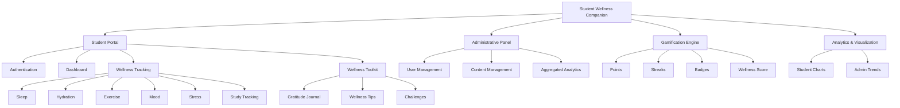
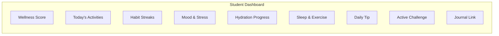
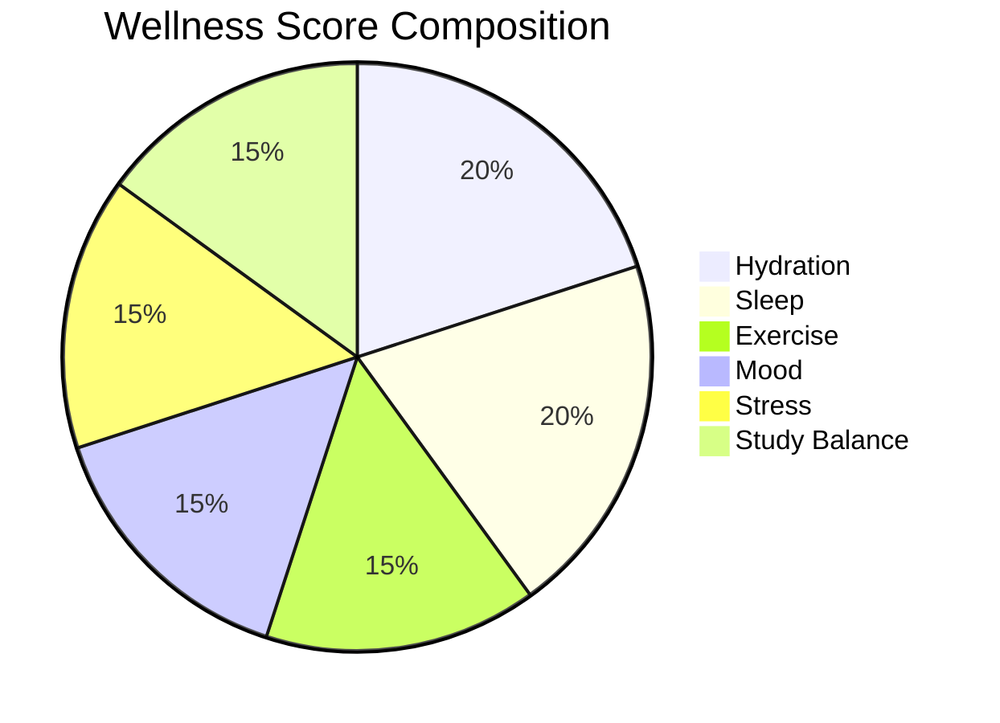
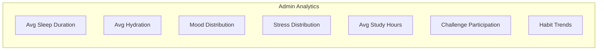
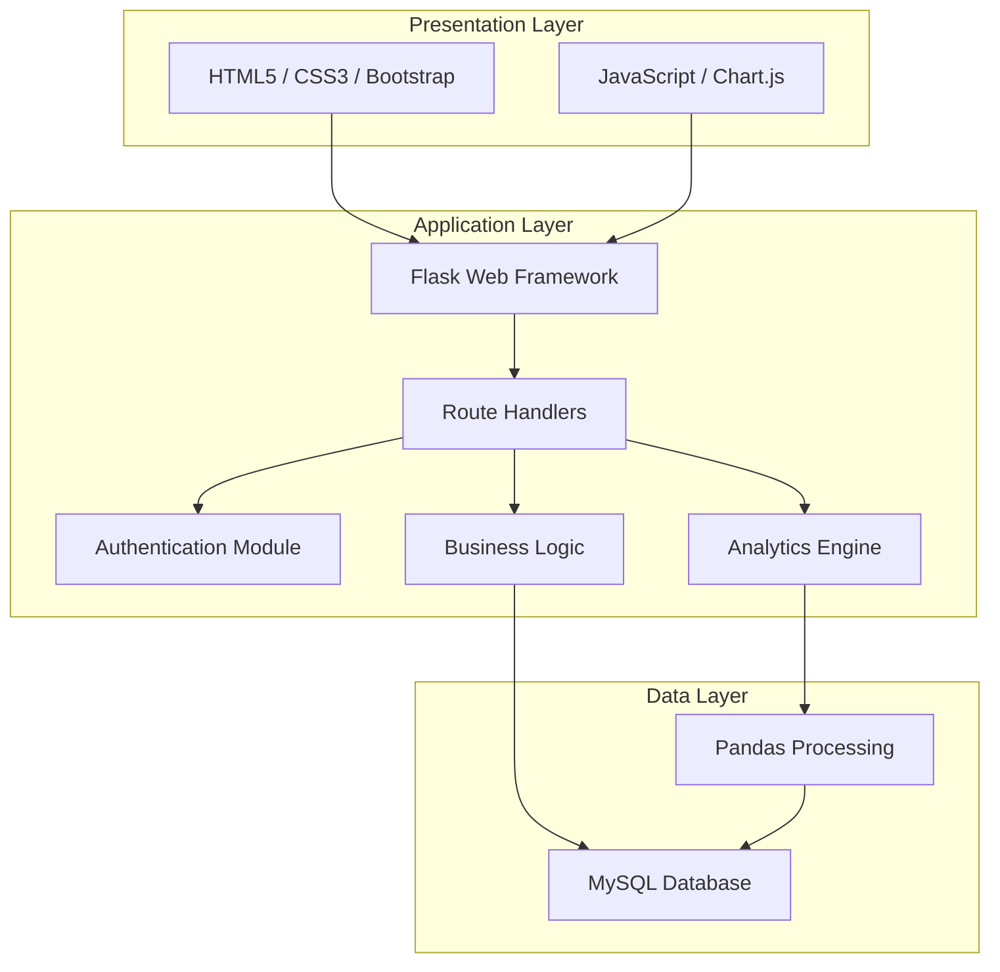
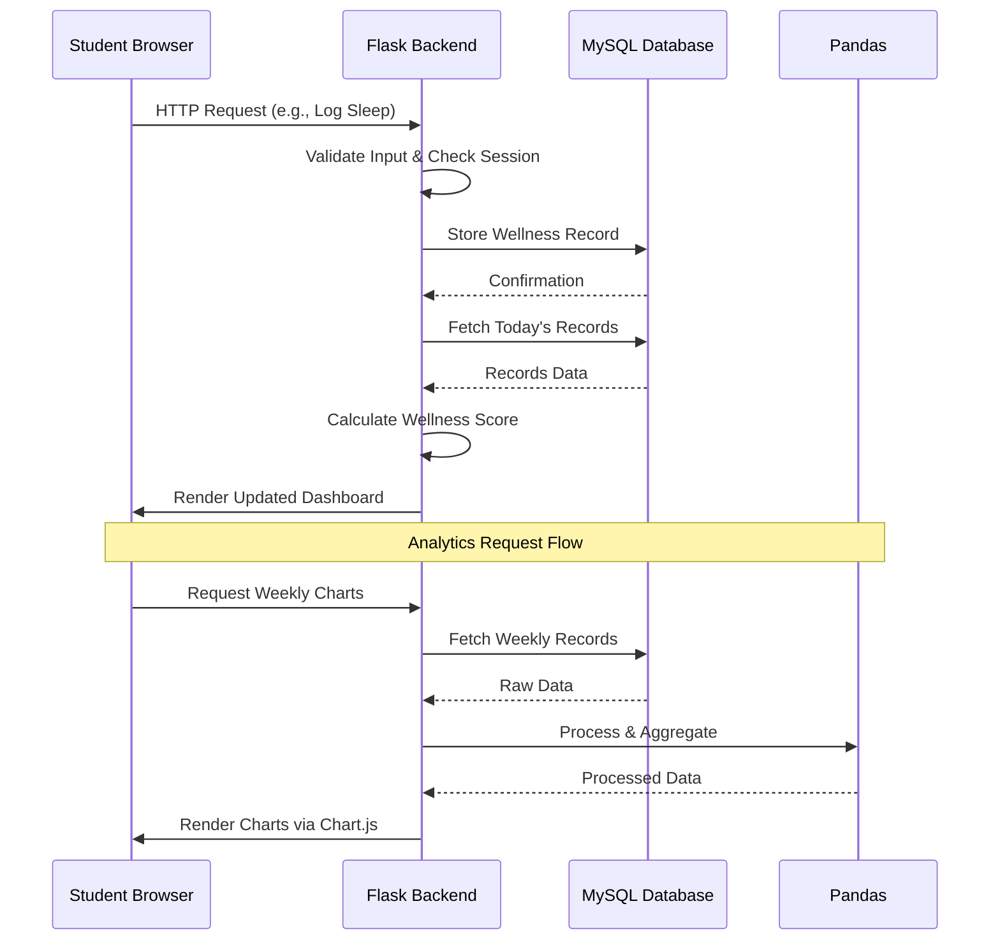
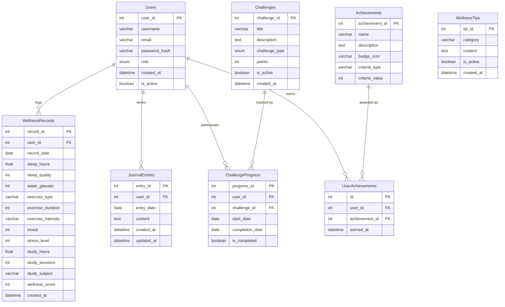
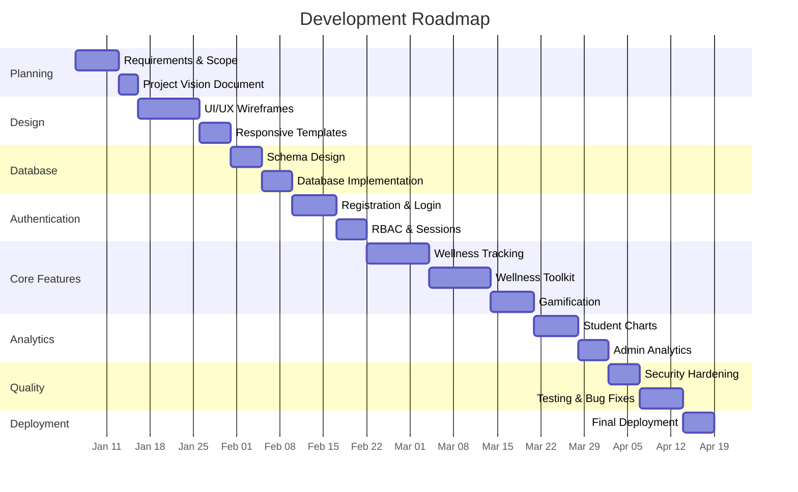

# Student Wellness Companion

**Project Vision and Product Requirements Document**

---

## Vision Statement

The Student Wellness Companion aims to empower college students to proactively manage their holistic well-being through a centralized and engaging web platform. By transforming daily habits into actionable insights, the system encourages students to maintain healthier routines, manage stress, improve self-awareness, and achieve a sustainable balance between academics and personal well-being.

This project is not intended to replace professional healthcare, counseling, or clinical intervention. It serves as a **self-awareness and habit-tracking tool** that helps students reflect on their daily routines and make informed choices about their well-being.

---

## Executive Summary

The Student Wellness Companion is a web-based platform designed specifically for college and university students. It consolidates multiple aspects of daily wellness — including sleep, hydration, exercise, mood, stress, and study habits — into a single, easy-to-use application.

Students can log their daily activities, maintain a personal gratitude journal, participate in wellness challenges, earn achievement badges, and visualize their progress over time through interactive charts. A rule-based wellness score provides a quick snapshot of daily habits, serving purely as an engagement indicator rather than a medical assessment.

On the administrative side, campus wellness coordinators can manage wellness content, create challenges, and access aggregated analytics to understand general wellness trends across the student body — all without compromising individual student privacy.

The application is built using a practical technology stack (Flask, MySQL, Bootstrap, Chart.js) that is well-suited for a BCA-level academic project while remaining extensible for future enhancements.

---

## Problem Statement

College students routinely face difficulty balancing academic responsibilities with personal health and well-being. The challenges are well-documented and widespread:

- **High academic stress** from coursework, exams, and deadlines
- **Irregular sleep schedules** caused by late-night studying and inconsistent routines
- **Inadequate water intake** throughout the day
- **Lack of physical activity** due to sedentary study habits
- **Poor time management** leading to last-minute cramming and burnout
- **Difficulty recognizing patterns** in mood and stress over time
- **Absence of consistent self-care routines** during demanding academic periods
- **Limited understanding** of how daily habits directly affect productivity and emotional state

While numerous wellness applications exist in the market, they are typically fragmented. A student might need one app for fitness tracking, another for meditation, a third for journaling, a fourth for study timers, and yet another for habit tracking. This fragmentation discourages consistent usage and makes it difficult to see the connections between different aspects of well-being.

The Student Wellness Companion addresses this gap by bringing all relevant student-focused wellness features together into one cohesive, web-based platform — purpose-built for the college experience.

---

## Proposed Solution

The Student Wellness Companion provides students with a centralized platform where they can record, monitor, and reflect on different aspects of their daily routine. The platform combines:

- **Physical wellness tracking** — sleep, hydration, and exercise logging
- **Mental well-being self-monitoring** — mood and stress level recording
- **Academic tracking** — study session duration and subject categorization
- **Habit tracking** — daily consistency monitoring with streaks
- **Journaling** — private gratitude and reflection entries
- **Wellness tips** — curated, practical advice on healthy routines
- **Positive challenges** — simple, achievable daily and weekly goals
- **Gamification** — points, badges, streaks, and wellness scores to sustain engagement
- **Progress visualization** — interactive charts and trend analysis

The system transforms manually entered daily information into simple visual insights, helping students understand their habits and identify areas for improvement. All data entry is manual and self-reported; the system does not integrate with wearable devices or external health APIs in its current scope.

**Important:** The application is positioned as a **wellness and self-awareness tool**. It does not perform medical diagnosis, provide clinical recommendations, or replace professional mental-health treatment.

---

## Target Audience

### Students (Primary Users)

The primary users are college and university students who want to:

- Develop healthier daily habits and maintain consistency
- Monitor sleep patterns and hydration levels
- Track physical exercise and activity
- Record mood and stress levels over time
- Log study hours and maintain academic balance
- Reflect through private journaling
- Understand personal wellness trends through visual data
- Participate in wellness challenges for motivation
- Improve their overall study-life balance

### Administrators (Secondary Users)

Secondary users include administrators or campus wellness coordinators who need to:

- Manage student accounts (activation, deactivation, basic information)
- Curate and update wellness tips and content
- Create and manage wellness challenges
- Moderate content where necessary
- View aggregated, anonymized wellness statistics
- Monitor general trends without accessing individual private information

---

## Project Objectives

### 1. Holistic Wellness Tracking

Allow students to record multiple dimensions of daily wellness in one place:

- Water intake (glasses or milliliters)
- Sleep duration and optional quality rating
- Exercise type, duration, and optional intensity
- Mood (predefined scale)
- Stress level (numeric scale)
- Study hours and optional subject categorization

### 2. Self-Awareness

Help students recognize relationships between their daily habits and their reported mood, stress, and productivity. For example, the system might surface a simple insight such as:

> "Your average stress level was lower on days when you recorded at least 7 hours of sleep."

These insights are pattern-based observations from the student's own data, not clinical assessments.

### 3. Gamification

Increase sustained engagement through:

- **Habit streaks** for consecutive days of activity logging
- **Wellness scores** calculated from daily inputs
- **Points** earned for completing wellness activities
- **Badges and achievements** for reaching milestones
- **Daily and weekly challenges** to encourage specific healthy behaviors

### 4. Reflection

Provide tools for personal reflection:

- Gratitude journal with private, dated entries
- Daily reflection prompts
- Mood notes attached to daily records
- Personal wellness history for retrospective review

### 5. Progress Visualization

Display meaningful visual representations of student data:

- Weekly and monthly trend charts for each tracked metric
- Habit completion percentages
- Wellness score trends over time
- Comparative views (e.g., sleep vs. stress correlation)

### 6. Institutional Insights

Provide administrators with aggregated, anonymized statistics to help identify general wellness trends among students. Individual identities, journal entries, and sensitive personal records are not exposed to administrators.

---

## Key Features

| Feature Category       | Key Capabilities                                                           |
| ---------------------- | -------------------------------------------------------------------------- |
| Wellness Tracking      | Sleep, hydration, exercise, mood, stress, and study logging                |
| Dashboard              | Personalized view with today's data, streaks, score, tips, and challenges  |
| Journaling             | Private gratitude journal with full CRUD operations                        |
| Gamification           | Points, streaks, badges, wellness score, and challenges                    |
| Visualization          | Interactive charts for trends, comparisons, and progress                   |
| Wellness Content       | Curated tips on sleep, hydration, exercise, stress, and time management    |
| Challenges             | Daily and weekly achievable wellness goals                                 |
| Admin Panel            | User management, content management, and aggregated analytics              |
| Privacy                | Role-based access, private journals, anonymized admin analytics            |

---

## System Modules

### Module Overview

---

### Student Portal

#### Authentication

The authentication module handles user identity and session management:

- **Student Registration** — New students can create an account with a username, email, and password. Passwords are hashed before storage; plaintext passwords are never stored.
- **Login** — Registered students authenticate using their credentials. On successful login, a server-side session is created.
- **Logout** — Students can securely end their session at any time.
- **Password Security** — Passwords are hashed using a standard algorithm (e.g., bcrypt via Werkzeug). Minimum password length and basic complexity rules are enforced during registration.
- **Profile Management** — Students can view and update basic profile information such as display name and email address.

#### Personalized Dashboard

The dashboard is the central hub for each student. Upon login, the dashboard displays:

- **Current Wellness Score** — A numeric or visual indicator calculated from today's logged activities
- **Today's Tracked Activities** — A summary of what the student has recorded today (sleep, water, exercise, mood, stress, study hours)
- **Habit Streaks** — Current streak counts for consistently tracked habits
- **Recent Mood** — The most recently recorded mood entry
- **Study Hours** — Today's logged study time
- **Hydration Progress** — Visual progress toward a daily water intake goal
- **Sleep Information** — Last recorded sleep duration and quality
- **Exercise Summary** — Today's activity type and duration
- **Quick Access to Journal** — A shortcut to the gratitude journal
- **Daily Wellness Tip** — A randomly selected or rotating tip from the curated collection
- **Active Challenge** — The current daily or weekly challenge with progress status

#### Wellness Tracking

Students can record the following wellness data points each day:

##### Sleep

- **Sleep duration** — Number of hours slept (numeric input)
- **Sleep quality** — Optional rating on a 1–5 scale (1 = Poor, 5 = Excellent)

##### Hydration

- **Water intake** — Number of glasses or milliliters consumed during the day

##### Exercise

- **Activity type** — Selection from common options (Walking, Running, Yoga, Gym, Sports, Cycling, Other)
- **Duration** — Time spent in minutes
- **Intensity** — Optional field (Light, Moderate, Vigorous)

##### Mood

A simple predefined scale for daily mood recording:

| Value | Label      |
| ----- | ---------- |
| 5     | Very Happy |
| 4     | Happy      |
| 3     | Neutral    |
| 2     | Sad        |
| 1     | Very Sad   |

##### Stress

A numeric scale from 1 to 5:

| Value | Meaning          |
| ----- | ---------------- |
| 1     | Very Low Stress  |
| 2     | Low Stress       |
| 3     | Moderate Stress  |
| 4     | High Stress      |
| 5     | Very High Stress |

##### Study Tracking

- **Study duration** — Total hours or minutes studied
- **Study sessions** — Number of distinct study sessions in the day
- **Subject/Category** — Optional field to tag the session (e.g., Mathematics, Programming, General)

---

### Wellness Toolkit

#### Gratitude Journal

Students can write short daily entries about things they are grateful for. The journal is designed to encourage positive reflection and mindfulness.

- **Date-stamped entries** — Each entry is automatically tagged with the date of creation
- **Free-text input** — Students write in their own words without rigid templates
- **Edit and delete** — Students can modify or remove their own entries
- **Personal history** — A chronological view of all past journal entries
- **Privacy** — Journal entries are strictly private. Only the student who created the entry can view, edit, or delete it. Administrators do not have access to individual journal content.

#### Wellness Tips

The system displays short, practical tips curated by administrators. Tips cover topics such as:

- Sleep hygiene and establishing bedtime routines
- Staying hydrated throughout the day
- Simple exercises and stretching during study breaks
- Stress management techniques (breathing exercises, progressive relaxation)
- Effective study break strategies (Pomodoro technique, 5-minute walks)
- Time management practices
- Building healthy daily routines
- Digital well-being (reducing screen time before sleep, managing notifications)

Tips are displayed on the student dashboard (one per visit or rotated daily) and can also be browsed in a dedicated tips section.

#### Confidence-Building Challenges

Challenges are simple, achievable goals designed to encourage students to take small positive actions. Examples include:

- Drink at least 8 glasses of water today
- Take a 15-minute walk between study sessions
- Sleep for at least 7 hours tonight
- Take a 10-minute study break every hour
- Write three things you are grateful for today
- Avoid screen time for 30 minutes before bed
- Do 10 minutes of stretching or yoga
- Compliment yourself on one accomplishment today

Challenges can be daily or weekly. Administrators create and manage the challenge library. Students can view active challenges on their dashboard and mark them as completed.

---

## Gamification

The gamification system is designed to sustain student engagement through positive reinforcement. It rewards consistency and effort, not perfection. The system avoids creating competitive pressure between students — all gamification elements are personal and self-referential.

### Points

Students earn points for completing wellness activities:

| Activity                        | Points |
| ------------------------------- | ------ |
| Log sleep                       | 10     |
| Log hydration                   | 10     |
| Log exercise                    | 15     |
| Record mood                     | 5      |
| Record stress level             | 5      |
| Log study hours                 | 10     |
| Write a journal entry           | 15     |
| Complete a daily challenge      | 20     |
| Complete a weekly challenge     | 50     |

Point values are indicative and can be adjusted by administrators or during development.

### Streaks

Streaks track the number of consecutive days a student has completed a specific habit. For example, logging water intake for 7 consecutive days earns a "7-Day Hydration Streak." Streaks reset if a day is missed, encouraging consistent behavior.

### Badges

Badges are visual achievements awarded when students reach specific milestones:

| Badge                    | Criteria                                           |
| ------------------------ | -------------------------------------------------- |
| 3-Day Streak             | Any habit maintained for 3 consecutive days         |
| 7-Day Streak             | Any habit maintained for 7 consecutive days         |
| 30-Day Streak            | Any habit maintained for 30 consecutive days        |
| Hydration Hero           | Logged adequate hydration for 7 consecutive days    |
| Early Sleeper            | Logged 7+ hours of sleep for 5 consecutive days     |
| Active Student           | Logged exercise for 7 days in a month               |
| Gratitude Starter        | Written 5 journal entries                           |
| Gratitude Champion       | Written 30 journal entries                          |
| Study Balance Champion   | Maintained balanced study hours for 2 weeks         |
| Challenge Conqueror      | Completed 10 challenges                             |
| Wellness Explorer        | Logged all 6 wellness categories in a single day    |

### Wellness Score

The wellness score provides a quick daily snapshot based on the student's logged activities. It is calculated using a simple rule-based formula:

| Component      | Weight |
| -------------- | ------ |
| Hydration      | 20%    |
| Sleep          | 20%    |
| Exercise       | 15%    |
| Mood           | 15%    |
| Stress         | 15%    |
| Study Balance  | 15%    |

Each component contributes to a score out of 100. The scoring logic evaluates whether the logged value falls within a reasonable range (e.g., 7–9 hours of sleep scores higher than 3 hours or 12 hours).

**Disclaimer:** The wellness score is purely an **engagement and self-awareness indicator**. It reflects the consistency and balance of self-reported habits. It is not a medical assessment, psychological evaluation, or clinical diagnosis of any kind. Students should consult qualified professionals for health concerns.

---

## Analytics and Visualization

### Student Analytics

The student dashboard provides interactive visual representations of personal data. Charts are rendered using Chart.js and include:

- **Weekly Sleep Chart** — Bar chart showing sleep duration for each day of the week
- **Hydration Progress Chart** — Daily water intake with a target line
- **Exercise Trend** — Activity frequency and duration over the past 4 weeks
- **Mood Trend** — Line chart showing mood fluctuations over time
- **Stress Trend** — Line chart mapping stress levels across days and weeks
- **Study-Hour Trend** — Weekly and monthly study time distribution
- **Wellness Score Trend** — Line chart illustrating the overall score over time
- **Habit Completion Percentage** — Donut chart showing the proportion of days each habit was logged

The system may surface simple observations based on the student's own data, such as:

> "You recorded lower stress on days when you exercised for at least 20 minutes."

> "Your mood was generally higher during weeks when you maintained your hydration streak."

These observations are generated from straightforward data comparisons and do not constitute medical advice.

### Admin Analytics

Administrators access aggregated, anonymized statistics through the admin panel. Individual student identities are not linked to specific data points in the analytics view.

Available admin analytics include:

- Average sleep duration across all students
- Average daily hydration levels
- General mood distribution (percentage of students reporting each mood level)
- General stress distribution
- Average study hours per day
- Challenge participation rates and completion percentages
- Overall habit completion trends over time

---

## Administrative Panel

### User Management

Administrators can perform the following account-related operations:

- **View registered users** — List all student accounts with basic information (username, email, registration date, account status)
- **Activate/Deactivate accounts** — Temporarily disable accounts that violate usage policies or reactivate previously disabled accounts
- **Manage basic user information** — Update profile details when necessary (e.g., correcting an email address upon student request)
- **Handle account issues** — Reset passwords or resolve locked accounts

Administrators **do not** have access to individual students' journal entries, mood records, stress logs, or other sensitive personal wellness data unless a specific and justified requirement dictates otherwise.

### Content Management

Administrators manage the wellness content that students see:

- **Wellness Tips** — Add new tips, edit existing tips, or remove outdated or inaccurate tips. Tips can be categorized by topic (sleep, hydration, exercise, stress, study habits, etc.).
- **Challenges** — Create new challenges with descriptions, duration (daily or weekly), and point values. Edit active challenges or retire completed ones.
- **Content Moderation** — Remove inappropriate or outdated content from the platform.

### Admin Analytics Dashboard

The administrative analytics dashboard presents aggregated data through charts and summary statistics. All data is anonymized before presentation. The dashboard is designed to give campus wellness coordinators a high-level understanding of student wellness trends, enabling data-informed decisions about wellness programs and initiatives.

---

## Privacy and Security

Wellness data is inherently personal and sensitive. The Student Wellness Companion is designed with privacy as a foundational principle, not an afterthought.

### Authentication and Authorization

- **Password Hashing** — All passwords are hashed using a proven algorithm (e.g., bcrypt) before storage. Plaintext passwords are never stored or logged.
- **Role-Based Access Control (RBAC)** — The system enforces two distinct roles: Student and Administrator. Each role has clearly defined permissions. Students cannot access administrative functions; administrators cannot access individual student wellness records.
- **Session Security** — User sessions are managed server-side using Flask's session management with secure cookie flags (HttpOnly, Secure where applicable). Sessions expire after a configurable period of inactivity.

### Data Protection

- **Input Validation** — All user inputs are validated and sanitized on the server side to prevent injection attacks.
- **SQL Injection Prevention** — Database queries use parameterized statements or ORM-based queries to prevent SQL injection vulnerabilities.
- **Journal Privacy** — Journal entries are accessible only to the student who wrote them. No other user, including administrators, can read, modify, or delete another student's journal entries through the application.
- **Data Minimization** — The system collects only the data necessary for its stated functionality. No unnecessary personal information is requested or stored.

### Administrative Data Access

- **Anonymized Analytics** — Administrator-facing analytics present aggregated data only. Individual student identities are not linked to specific wellness metrics in the admin dashboard.
- **Access Logging** — Administrative actions (account activation/deactivation, content changes) are logged for accountability.

### Responsible Disclosure

The project does not claim compliance with specific legal frameworks (such as HIPAA, GDPR, or FERPA) unless those standards are explicitly implemented and verified. However, the design principles align with general best practices for handling sensitive personal data in educational settings.

---

## Functional Requirements

| ID    | Requirement                                                                                      |
| ----- | ------------------------------------------------------------------------------------------------ |
| FR-01 | The system shall allow students to register with a unique username, email, and secure password.   |
| FR-02 | The system shall allow registered students to log in using their credentials.                     |
| FR-03 | The system shall allow students to log out and securely terminate their session.                  |
| FR-04 | The system shall allow students to view and update their profile information.                     |
| FR-05 | The system shall allow students to record daily sleep duration and optional quality rating.       |
| FR-06 | The system shall allow students to record daily water intake.                                     |
| FR-07 | The system shall allow students to record exercise activities with type, duration, and intensity. |
| FR-08 | The system shall allow students to record their daily mood using a predefined scale.              |
| FR-09 | The system shall allow students to record their daily stress level on a 1–5 scale.               |
| FR-10 | The system shall allow students to log study sessions with duration and optional subject.         |
| FR-11 | The system shall calculate a daily wellness score based on logged activities.                     |
| FR-12 | The system shall display a personalized dashboard with today's data, streaks, and score.         |
| FR-13 | The system shall display wellness trends using interactive charts.                                |
| FR-14 | The system shall allow students to create, edit, and delete private journal entries.              |
| FR-15 | The system shall ensure journal entries are accessible only to the student who created them.      |
| FR-16 | The system shall display curated wellness tips to students.                                       |
| FR-17 | The system shall present active wellness challenges to students.                                  |
| FR-18 | The system shall track challenge completion progress for each student.                            |
| FR-19 | The system shall maintain habit streak counts for consecutive daily logging.                      |
| FR-20 | The system shall award points for completing wellness activities.                                 |
| FR-21 | The system shall award badges when students achieve predefined milestones.                       |
| FR-22 | The system shall allow administrators to log in with administrative credentials.                  |
| FR-23 | The system shall allow administrators to view and manage student accounts.                        |
| FR-24 | The system shall allow administrators to add, edit, and delete wellness tips.                     |
| FR-25 | The system shall allow administrators to create, edit, and retire wellness challenges.            |
| FR-26 | The system shall display aggregated, anonymized wellness analytics to administrators.             |
| FR-27 | The system shall prevent unauthorized users from accessing restricted pages or data.              |
| FR-28 | The system shall validate all user inputs on the server side before processing.                   |

---

## Non-Functional Requirements

### Usability

The interface must be clean, intuitive, and student-friendly. Navigation should be straightforward, with no more than two or three clicks required to reach any major feature from the dashboard. Form inputs should use appropriate controls (dropdowns, sliders, number fields) to minimize user effort.

### Performance

Dashboard pages and common operations (logging wellness data, viewing charts, browsing tips) should load within 2–3 seconds under normal conditions. Chart rendering should be smooth and responsive. Database queries should be optimized with appropriate indexing.

### Security

User credentials must be hashed and never stored in plaintext. Role-based access control must be enforced consistently across all routes. All form inputs must be validated and sanitized to prevent injection attacks. Sessions must be properly managed with appropriate timeout policies.

### Reliability

The system must correctly store all user-submitted records and retrieve them accurately. Data should not be lost, duplicated, or corrupted during normal operations. Error handling should prevent application crashes from propagating to the user.

### Scalability

The application architecture should be modular enough to allow new wellness tracking categories, additional gamification elements, or further administrative features to be added without requiring significant restructuring of existing code.

### Maintainability

The codebase should follow a clear organizational structure with separation of concerns (routes, models, templates, static assets). Code should be commented where logic is non-obvious. Database interactions should be centralized through a data access layer or ORM.

### Responsiveness

The application must render correctly and remain fully functional on:

- Desktop browsers (1920×1080 and above)
- Laptops (1366×768 and similar)
- Tablets (768×1024, both orientations)
- Mobile browsers (360×640 and similar)

Bootstrap's responsive grid system will be used to ensure consistent behavior across screen sizes.

---

## User Roles and Permissions

| Feature                          | Student | Administrator |
| -------------------------------- | ------- | ------------- |
| Register for an account          | ✓       | Pre-created   |
| Log in                           | ✓       | ✓             |
| Log out                          | ✓       | ✓             |
| View and edit own profile        | ✓       | Limited       |
| Record daily wellness data       | ✓       | ✗             |
| View personal wellness data      | ✓       | ✗             |
| View personal wellness charts    | ✓       | ✗             |
| Write and manage journal entries | ✓       | ✗             |
| View wellness tips               | ✓       | ✓             |
| Manage wellness tips (CRUD)      | ✗       | ✓             |
| Participate in challenges        | ✓       | ✗             |
| Create and manage challenges     | ✗       | ✓             |
| View personal streaks and badges | ✓       | ✗             |
| View aggregated analytics        | ✗       | ✓             |
| Manage student accounts          | ✗       | ✓             |
| Access other students' journals  | ✗       | ✗             |

---

## Technology Stack

### Frontend

| Technology  | Purpose                                                        |
| ----------- | -------------------------------------------------------------- |
| HTML5       | Page structure and semantic markup                             |
| CSS3        | Styling, layout, and responsive design                         |
| JavaScript  | Client-side interactivity, form validation, and chart handling |
| Bootstrap 5 | Responsive grid system, UI components, and mobile-first design |
| Chart.js    | Interactive data visualization (line, bar, pie, donut charts)  |

### Backend

| Technology | Purpose                                                         |
| ---------- | --------------------------------------------------------------- |
| Python 3   | Server-side programming language                                |
| Flask      | Lightweight web framework for routing, templates, and sessions  |
| Jinja2     | Server-side HTML templating (integrated with Flask)             |
| Werkzeug   | Password hashing and HTTP utility functions (bundled with Flask) |

Flask is chosen over Django because the project scope is well-suited to a lightweight framework. Flask provides sufficient structure for routing, templating, and session management without the overhead of Django's built-in admin, ORM, and authentication system — all of which would be implemented manually as learning exercises in this project.

### Database

| Technology | Purpose                                                 |
| ---------- | ------------------------------------------------------- |
| MySQL      | Relational database for persistent data storage         |
| PyMySQL    | Python MySQL connector for database interaction         |

### Data Processing

| Technology | Purpose                                                       |
| ---------- | ------------------------------------------------------------- |
| Pandas     | Data aggregation, transformation, and analytics computation   |

Pandas is used on the backend to process wellness records, compute averages, identify trends, and prepare data for chart rendering. It simplifies operations that would otherwise require complex SQL queries or manual Python loops.

---

## High-Level System Architecture

The application follows a standard **three-layer architecture** suitable for a web-based student project:

### Architecture Description

**Presentation Layer** — Responsible for rendering the user interface in the browser. HTML templates (rendered via Jinja2) provide the page structure, CSS and Bootstrap handle styling and responsiveness, and JavaScript with Chart.js manages client-side interactivity and data visualization.

**Application Layer** — The Flask backend handles HTTP requests, routes them to appropriate handler functions, manages user sessions and authentication, executes business logic (wellness score calculation, streak tracking, badge awarding), and prepares data for template rendering.

**Data Layer** — MySQL stores all persistent data including user accounts, wellness records, journal entries, tips, challenges, and achievements. Pandas is used within the application layer to perform data aggregation and analytics computations before results are sent to the presentation layer.

### Request Flow

---

## Database Overview

### Entity-Relationship Diagram

### Table Descriptions

#### Users

Stores all user accounts, both students and administrators.

- **Key Fields:** `user_id` (PK), `username`, `email`, `password_hash`, `role` (student/admin), `is_active`, `created_at`
- **Relationships:** One-to-many with WellnessRecords, JournalEntries, ChallengeProgress, UserAchievements
- **Notes:** The `role` field determines access permissions. The `is_active` flag allows administrators to deactivate accounts without deleting data.

#### WellnessRecords

Stores daily wellness data logged by students. Each record represents one day's worth of wellness entries for a single student.

- **Key Fields:** `record_id` (PK), `user_id` (FK), `record_date`, `sleep_hours`, `sleep_quality`, `water_glasses`, `exercise_type`, `exercise_duration`, `exercise_intensity`, `mood`, `stress_level`, `study_hours`, `study_sessions`, `study_subject`, `wellness_score`
- **Relationships:** Many-to-one with Users
- **Notes:** A consolidated table is used instead of separate tables for each metric (sleep, hydration, exercise, etc.) to simplify queries and reduce join complexity. This design is practical for a student project where the number of tracked metrics is known and stable. Optional fields (sleep quality, exercise intensity, study subject) can be NULL.

#### JournalEntries

Stores private gratitude journal entries written by students.

- **Key Fields:** `entry_id` (PK), `user_id` (FK), `entry_date`, `content`, `created_at`, `updated_at`
- **Relationships:** Many-to-one with Users
- **Notes:** Journal entries are strictly private. Application-level access control ensures only the owning student can read, edit, or delete entries.

#### WellnessTips

Stores curated wellness tips managed by administrators.

- **Key Fields:** `tip_id` (PK), `category`, `content`, `is_active`
- **Relationships:** Standalone (no foreign key relationships)
- **Notes:** Tips are categorized for filtering (sleep, hydration, exercise, stress, study, general). The `is_active` flag allows soft-deletion without losing content.

#### Challenges

Stores wellness challenges created by administrators.

- **Key Fields:** `challenge_id` (PK), `title`, `description`, `challenge_type` (daily/weekly), `points`, `is_active`
- **Relationships:** One-to-many with ChallengeProgress

#### ChallengeProgress

Tracks each student's participation and completion status for challenges.

- **Key Fields:** `progress_id` (PK), `user_id` (FK), `challenge_id` (FK), `start_date`, `completion_date`, `is_completed`
- **Relationships:** Many-to-one with Users and Challenges

#### Achievements

Defines the available badges and achievements in the system.

- **Key Fields:** `achievement_id` (PK), `name`, `description`, `badge_icon`, `criteria_type`, `criteria_value`
- **Relationships:** One-to-many with UserAchievements
- **Notes:** `criteria_type` and `criteria_value` define the condition for earning the badge (e.g., criteria_type = "streak", criteria_value = 7 means 7-day streak).

#### UserAchievements

Junction table recording which achievements each student has earned.

- **Key Fields:** `id` (PK), `user_id` (FK), `achievement_id` (FK), `earned_at`
- **Relationships:** Many-to-one with Users and Achievements

### Design Rationale

The database uses a **consolidated WellnessRecords table** rather than separate tables for each wellness metric. This decision is based on the following considerations:

1. **Simplicity** — A single table with nullable columns is easier to query, maintain, and understand in a student project context.
2. **Reduced Joins** — Dashboard queries that need multiple metrics from the same day can retrieve everything in a single query.
3. **Practical Scope** — The number of wellness metrics is fixed and known. If the system were to support user-defined custom metrics, separate tables would be more appropriate. For the current scope, consolidation is the pragmatic choice.

If future requirements demand more flexible or dynamic tracking categories, the design can be refactored into a normalized structure with separate metric tables and a unified query layer.

---

## Project Scope

### In Scope

The following features are planned for implementation in the current version of the project:

- Student registration, login, logout, and session management
- Basic profile management
- Daily wellness logging (sleep, hydration, exercise, mood, stress, study hours)
- Personalized student dashboard
- Rule-based wellness score calculation
- Habit streak tracking
- Points and badge system
- Private gratitude journal with CRUD operations
- Curated wellness tips (admin-managed)
- Wellness challenges (admin-created, student-participated)
- Interactive charts for personal wellness trends (Chart.js)
- Administrator login and role-based access
- Admin user management (view, activate/deactivate)
- Admin content management (tips and challenges)
- Aggregated, anonymized admin analytics
- Responsive design for desktop and mobile browsers
- Server-side input validation and password hashing
- Protection against SQL injection

### Out of Scope

The following are explicitly outside the scope of the current project:

- **Medical diagnosis or clinical assessment** — The system does not diagnose health conditions
- **Professional psychological counseling** — The system does not provide therapy or counseling services
- **Emergency mental-health services** — The system does not include crisis intervention features
- **Automatic medical recommendations** — The system does not prescribe treatments or medications
- **Wearable device integration** — No integration with smartwatches, fitness bands, or health sensors
- **AI-based diagnosis or predictive modeling** — No machine learning models for health prediction
- **Direct clinical intervention** — The system does not connect to healthcare providers
- **Real-time notifications or push alerts** — Not included in the initial version
- **Social features** — No friend lists, leaderboards, or social wellness sharing
- **Third-party API integrations** — No integration with external fitness or health platforms
- **Offline functionality** — The application requires an active internet connection

---

## Future Enhancements

The following features are identified as potential improvements for future versions of the project. They are not part of the current scope but represent realistic evolution paths:

- **Mobile Application** — Native or hybrid mobile app for Android and iOS
- **Wearable Device Integration** — Automatic data sync from fitness trackers and smartwatches
- **Personalized Recommendations** — Tailored wellness suggestions based on individual patterns
- **AI-Based Conversational Assistant** — A chatbot providing wellness guidance and check-ins
- **Advanced Analytics** — Correlation analysis, predictive trends, and comparative insights
- **Notification and Reminder System** — Push notifications for hydration reminders, sleep goals, and challenges
- **University-Wide Wellness Programs** — Integration with institutional wellness initiatives
- **Calendar Integration** — Sync with academic calendars to correlate exam schedules with stress data
- **Personalized Habit Recommendations** — System-generated habit suggestions based on identified gaps
- **Progressive Web App (PWA)** — Offline support and installable web experience
- **Multilingual Support** — Interface available in multiple languages
- **Data Export** — Allow students to export their wellness data in CSV or PDF format
- **Peer Support Groups** — Optional, moderated peer wellness groups (with strict privacy controls)

---

## Expected Impact

The Student Wellness Companion is expected to contribute positively to the student experience in the following ways:

- **Improved Self-Awareness** — Regular logging encourages students to pay attention to their daily habits and recognize patterns they might otherwise overlook.
- **Healthier Routines** — Tracking and gamification provide motivation to maintain consistent sleep, hydration, exercise, and study habits.
- **Balanced Study Habits** — Study tracking helps students recognize overwork or inconsistency and adjust accordingly.
- **Regular Hydration and Exercise** — Daily logging with visual progress indicators makes these essential habits more tangible and achievable.
- **Structured Reflection** — The gratitude journal offers a simple outlet for positive reflection, which research associates with improved subjective well-being.
- **Sustained Engagement** — Points, streaks, badges, and challenges keep students returning to the platform and maintaining consistency.
- **Institutional Insights** — Aggregated analytics give campus coordinators a data-informed understanding of general wellness trends, supporting evidence-based wellness programming.
- **Healthier Academic Environment** — By encouraging students to balance academic effort with self-care, the platform contributes to a campus culture that values well-being alongside achievement.

The project does not claim to cure, prevent, or treat any medical or psychological condition. Its value lies in building awareness, encouraging positive habits, and providing a structured framework for self-monitoring.

---

## Success Criteria

The project will be considered successful if the following criteria are met:

1. Students can successfully register, log in, and log out of the application.
2. Students can record daily wellness information across all six tracking categories.
3. The personalized dashboard correctly displays the current day's data, streaks, and wellness score.
4. Interactive charts accurately represent historical wellness records.
5. Habit streaks increment correctly on consecutive days and reset appropriately on missed days.
6. Badges and achievements are awarded when milestone criteria are met.
7. Students can create, view, edit, and delete private journal entries.
8. Journal entries are inaccessible to any user other than the author.
9. Wellness tips and challenges are visible to students and manageable by administrators.
10. Challenge progress is tracked and displayed correctly.
11. The administrator dashboard displays aggregated, anonymized analytics.
12. Administrative analytics do not expose individual student identities or private data.
13. Unauthorized users cannot access restricted pages or perform privileged operations.
14. The application renders correctly and functions properly on desktop, tablet, and mobile browsers.
15. All form inputs are validated on the server side, and the application handles invalid input gracefully.

---

## Risks and Limitations

| Risk / Limitation                                | Impact   | Mitigation Strategy                                                              |
| ------------------------------------------------ | -------- | -------------------------------------------------------------------------------- |
| Students may not consistently enter data          | High     | Use gamification (streaks, points, badges) and challenges to encourage daily use |
| Self-reported data may be inaccurate              | Medium   | Clearly position the system as a self-awareness tool, not a clinical instrument  |
| Privacy concerns may reduce user participation    | High     | Enforce strict privacy controls, communicate data handling practices transparently|
| Excessive gamification could create pressure       | Medium   | Keep gamification personal (no public leaderboards), focus on encouragement      |
| Limited project development time                  | High     | Prioritize core features, defer enhancements to future versions                  |
| Limited dataset size during testing               | Medium   | Use representative test data, document testing limitations                       |
| Wellness score may oversimplify well-being        | Medium   | Clearly label the score as an engagement indicator, not a health assessment      |
| Students may misinterpret data as medical advice  | High     | Include disclaimers, avoid clinical language, position system as a habit tracker  |
| Single-server deployment may limit scalability    | Low      | Acceptable for a student project; document scalability path for future work       |

---

## Development Roadmap

### Phase 1 — Planning and Requirements

- Define project scope and objectives
- Gather and document requirements
- Identify target users and use cases
- Finalize the technology stack
- Create this project vision document

### Phase 2 — UI/UX Design

- Design wireframes for the student dashboard
- Design wireframes for the admin panel
- Define the visual style guide (colors, typography, spacing)
- Create responsive layout templates using Bootstrap
- Design form layouts for wellness data entry

### Phase 3 — Database Design and Implementation

- Finalize the database schema based on the entity-relationship diagram
- Create the MySQL database and all required tables
- Define indexes for frequently queried columns
- Populate reference data (initial tips, achievements, challenge templates)
- Write and test basic CRUD queries

### Phase 4 — Authentication and Authorization

- Implement student registration with input validation
- Implement secure login with password hashing (bcrypt)
- Implement session management and logout
- Implement role-based access control (student vs. admin routes)
- Create route decorators for protected pages

### Phase 5 — Wellness Tracking Module

- Build data entry forms for all six wellness categories
- Implement server-side validation for all wellness inputs
- Store wellness records in the database
- Calculate and store the daily wellness score
- Display today's tracked data on the dashboard

### Phase 6 — Wellness Toolkit

- Implement the gratitude journal (create, read, update, delete)
- Enforce journal privacy at the application level
- Build the wellness tips display with category filtering
- Implement the challenges system with participation tracking
- Display active challenges and progress on the dashboard

### Phase 7 — Gamification

- Implement the points system and accumulation logic
- Build streak tracking with daily reset logic
- Define achievement criteria and implement badge awarding
- Display earned badges and points on the student profile/dashboard
- Calculate and display the wellness score with component breakdown

### Phase 8 — Analytics and Visualization

- Implement student-facing charts using Chart.js (sleep, hydration, exercise, mood, stress, study, wellness score)
- Build the weekly and monthly data aggregation logic using Pandas
- Generate simple pattern-based observations from student data
- Implement the admin analytics dashboard with aggregated statistics
- Ensure all admin analytics are anonymized

### Phase 9 — Security and Testing

- Review and harden input validation across all forms
- Verify role-based access control on all protected routes
- Test against SQL injection and common web vulnerabilities
- Perform functional testing of all user stories
- Test responsive behavior across desktop, tablet, and mobile viewports
- Fix identified bugs and edge cases

### Phase 10 — Deployment and Demonstration

- Prepare the application for final deployment
- Configure the production environment
- Conduct end-to-end demonstration testing
- Prepare project documentation and user guide
- Present the project for academic review

---

## Project Assumptions

The following assumptions underpin the project plan and design:

1. Students have access to a modern web browser (Chrome, Firefox, Edge, or Safari) on their personal devices.
2. Students have a reliable internet connection for accessing the web application.
3. The MySQL database server will be available and accessible to the Flask application.
4. The project will be developed and demonstrated in a controlled academic environment (local machine or university server).
5. Students will voluntarily enter their own wellness data; the system does not automate data collection.
6. Administrator accounts will be pre-created by the system administrator (not self-registered).
7. The project timeline allows approximately 10–14 weeks for development, testing, and deployment.
8. Third-party libraries (Flask, Bootstrap, Chart.js, Pandas, PyMySQL) will remain available and compatible during development.
9. The system will be used by a small to moderate number of concurrent users (class or department scale), not university-wide scale.
10. All wellness data is self-reported, and the system does not verify the accuracy of user inputs.

---

## Final Project Vision

The Student Wellness Companion envisions a future where college students have a personal, private, and engaging platform to monitor and reflect on their daily well-being. It recognizes that wellness is not a single metric but a combination of physical habits, mental state, academic effort, and personal reflection.

By consolidating sleep tracking, hydration monitoring, exercise logging, mood and stress recording, study-hour tracking, journaling, and gamification into a single, cohesive web application, the project addresses the fragmentation that makes existing wellness tools impractical for busy students.

The platform is designed with the student at its center. Every feature exists to provide meaningful value — whether it is a streak counter that motivates consistency, a chart that reveals a connection between sleep and stress, or a private journal entry that captures a moment of gratitude. The gamification elements are deliberately personal and non-competitive, encouraging healthy habits without creating pressure.

For institutions, the anonymized analytics provide a window into the general wellness of the student body, enabling data-informed decisions about campus wellness initiatives without compromising individual privacy.

This project is intentionally scoped for realistic implementation within a BCA-level academic project. The architecture is modular, the technology stack is practical, and the feature set is achievable. At the same time, the design leaves clear pathways for future enhancement — mobile applications, wearable integration, personalized AI recommendations, and university-wide wellness programs.

The Student Wellness Companion is not a medical tool. It is a mirror — helping students see their habits clearly, reflect on their choices, and take small, consistent steps toward a healthier and more balanced college experience.

---

*Document prepared as part of the Student Wellness Companion project. This document serves as the project vision, product requirements specification, and high-level technical design reference.*
