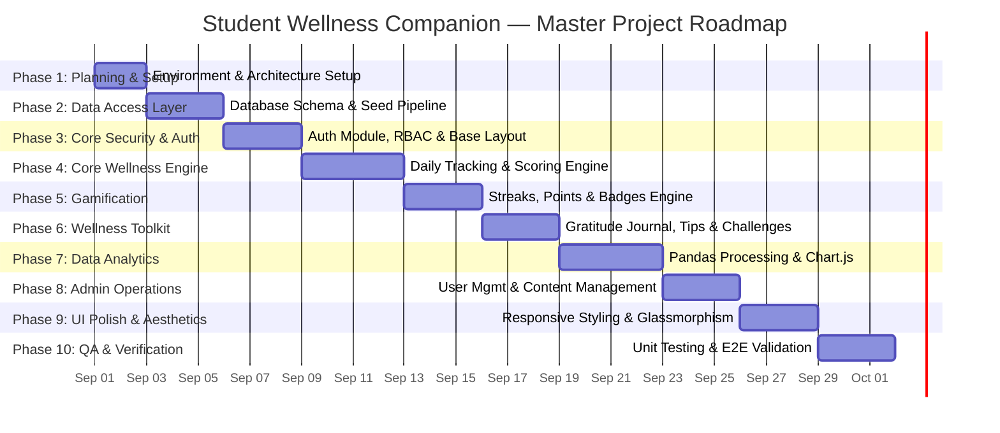
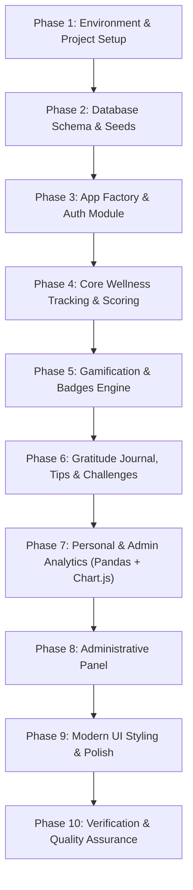

# Student Wellness Companion (Wellvia) — Comprehensive Project Roadmap

**Version:** 1.0  
**Status:** Approved & In Execution  
**Source of Truth:** [PROJECT_VISION.md](PROJECT_VISION.md), [SYSTEM_DESIGN.md](SYSTEM_DESIGN.md), [ARCHITECTURE.md](ARCHITECTURE.md)

---

## 1. Executive Summary & Vision Statement

The **Student Wellness Companion (Wellvia)** is a web-based platform designed specifically for college students to track, reflect on, and improve their daily physical, mental, and academic well-being. The system unifies tracking for sleep, hydration, exercise, mood, stress, and study habits with a private gratitude journal, admin-curated tips, achievable challenges, and personalized analytics.

> **Disclaimer:** Wellvia is a **self-awareness and habit-tracking tool**. It does not perform medical diagnosis, provide clinical therapy, or replace healthcare professionals.

---

## 2. Technology Stack & Architecture

- **Architecture:** 3-Layer Monolithic Web Application (Presentation Layer, Application Layer, Data Access Layer)
- **Backend:** Python 3, Flask 3.x, Jinja2, Werkzeug (bcrypt security), PyMySQL, Pandas
- **Database:** MySQL 8.0+ relational database (8 normalized tables)
- **Frontend:** HTML5, Custom Vanilla CSS, Bootstrap 5.3, JavaScript (ES6+), Chart.js 4.x
- **Privacy & Security:** Role-Based Access Control (RBAC), parameterized SQL execution, session-isolated gratitude journal, anonymized aggregate admin analytics.

---

## 3. High-Level Master Timeline

---

## 4. Phase-by-Phase Deliverables & Milestones

### Phase 1 — Project Foundation & Configuration
- **Deliverables:**
  - Project workspace structure (`app/`, `config/`, `tests/`, `static/`, `templates/`).
  - Python dependencies manifest (`requirements.txt`).
  - Configuration settings class (`config/settings.py`) managing environment variables via `.env`.
  - Application entry point launcher (`run.py`).

### Phase 2 — Database Schema & Data Access Layer
- **Deliverables:**
  - `schema.sql`: DDL script defining all 8 normalized database tables (`users`, `wellness_records`, `journal_entries`, `wellness_tips`, `challenges`, `challenge_progress`, `achievements`, `user_achievements`).
  - `seed.sql` & `init_db.py`: Database initializer seeding default achievements, wellness tips, challenges, and pre-created admin credentials (`admin@wellvia.edu` / `Admin@123`).
  - `app/models/db.py`: Database helper abstraction utilizing PyMySQL with parameterized query execution.

### Phase 3 — Core Application Architecture & Auth Module
- **Deliverables:**
  - `app/__init__.py`: Flask Application Factory (`create_app()`).
  - `app/utils/decorators.py`: Security route decorators (`@login_required`, `@student_required`, `@admin_required`).
  - `app/utils/validation.py`: Server-side input validation functions.
  - `app/routes/auth.py`: Registration (`/register`), Login (`/login`), and Logout (`/logout`).
  - UI Templates: Master layout (`base.html`), login, registration, and error views (404, 403, 500).

### Phase 4 — Core Wellness Tracking & Scoring Engine
- **Deliverables:**
  - `app/services/scoring.py`: Rule-based Wellness Score calculation engine (0-100 score out of Hydration 20%, Sleep 20%, Exercise 15%, Mood 15%, Stress 15%, Study 15%) with missing data weight redistribution.
  - `app/services/wellness.py`: Daily metrics logger handling upserts on `wellness_records`.
  - `app/routes/student.py`: Student routes for `/dashboard` and `/wellness` log form.
  - `app/templates/dashboard.html` & `app/templates/wellness/log.html`: Student dashboard showing daily score, streak, hydration progress, tip of the day, and active challenge.

### Phase 5 — Gamification & Achievements Engine
- **Deliverables:**
  - `app/services/gamification.py`:
    - Running total points manager (+10 log, +15 journal, +20/+50 challenges).
    - Dynamic streak calculator inspecting consecutive logging dates.
    - Achievement condition evaluator awarding badges (e.g. 3-Day Streak, Hydration Hero, Early Sleeper, Gratitude Starter, Challenge Conqueror).
  - `app/templates/profile.html`: Student profile view showcasing earned badge collection.

### Phase 6 — Wellness Toolkit (Journal, Tips & Challenges)
- **Deliverables:**
  - `app/services/journal.py`: Private gratitude journal CRUD service with strict session ownership (`WHERE user_id = session['user_id']`).
  - `app/templates/journal/index.html` & `edit.html`: Gratitude journal UI.
  - `app/templates/tips/index.html`: Curated wellness tips viewer with category filters.
  - `app/templates/challenges/index.html`: Active challenges hub supporting daily/weekly completion actions and point rewards.

### Phase 7 — Data Analytics & Visualization (Pandas + Chart.js)
- **Deliverables:**
  - `app/services/analytics.py`: Student analytics processing service using Pandas to compute continuous date series, moving averages, habit completion rates, and pattern-based observations.
  - `app/services/admin_analytics.py`: Admin aggregate analytics service producing anonymized summary stats.
  - `app/static/js/charts.js`: Modular Chart.js initialization script for Line, Bar, and Doughnut charts.
  - `app/templates/progress.html`: Student progress visualization dashboard.

### Phase 8 — Administrative Panel & Content Management
- **Deliverables:**
  - `app/routes/admin.py`: Admin routes for dashboard, user management, tip management, and challenge management.
  - Admin Templates: `admin/dashboard.html`, `admin/users.html`, `admin/tips.html`, `admin/challenges.html`.

### Phase 9 — Modern UI Aesthetics & Responsive Styling
- **Deliverables:**
  - `app/static/css/style.css`: Curated color palette (Deep Slate `#0f172a`, Teal `#0d9488`, Emerald `#10b981`), Inter/Outfit typography, glassmorphism cards, micro-animations, and full mobile responsiveness.

### Phase 10 — Testing & Quality Assurance
- **Deliverables:**
  - `tests/test_scoring.py`: Unit tests for score normalizations and composite score calculation.
  - `tests/test_validation.py`: Unit tests for input validators.
  - Automated test execution via Python `unittest` framework.

---

## 5. Future Evolutionary Roadmap

The modular 3-layer foundation enables future expansion beyond the current scope:

1. **Progressive Web App (PWA):** Service worker integration for offline logging and push reminders.
2. **REST API Decoupling:** Refactoring Flask route handlers into JSON API endpoints for mobile consumption.
3. **Native Mobile App:** React Native or Flutter companion app for iOS and Android.
4. **Wearable Integration:** Direct sync with Google Fit / Apple Health APIs.
