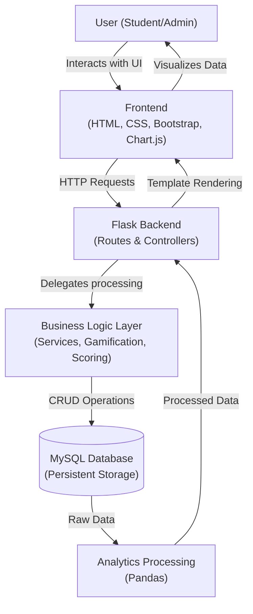
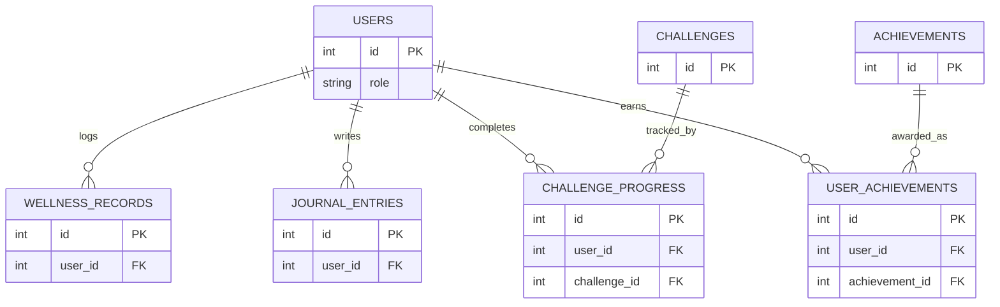
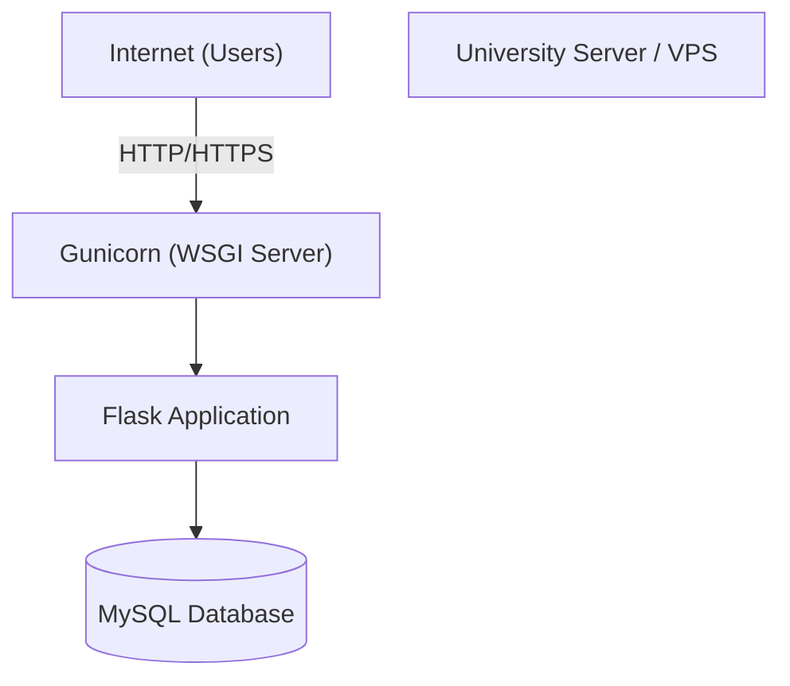

# Student Wellness Companion - System Design Document

**Version:** 1.0
**Source of Truth:** [PROJECT_VISION.md](PROJECT_VISION.md), [ARCHITECTURE.md](ARCHITECTURE.md)

---

## 1. System Overview

The Student Wellness Companion is a web-based application built on a practical three-layer architecture. It allows college students to track daily wellness metrics, maintain a private journal, and participate in challenges, while providing administrators with anonymized, aggregated insights.

The system flow relies on a client-server model where the frontend (rendered HTML/JS) communicates with a Flask backend, which in turn interacts with a MySQL database.



---

## 2. Design Goals

The system design prioritizes the following goals, suitable for a BCA-level project:

*   **Simplicity:** Avoiding over-engineering (no microservices or complex cloud-native orchestration). The monolith Flask app is easy to understand and deploy.
*   **Maintainability:** Using a modular directory structure and separating routing, business logic, and data access.
*   **Security:** Hashing passwords with `bcrypt`, preventing SQL injection via parameterized queries, and securing sessions.
*   **Privacy:** Strict authorization checks ensuring students can only access their own data. Admin analytics are heavily aggregated.
*   **Modularity:** Distinct modules for Authentication, Wellness Tracking, Gamification, etc.
*   **Usability:** A responsive, mobile-first frontend using Bootstrap 5.
*   **Reliability:** Robust server-side validation to ensure database integrity.
*   **Extensibility:** A clean relational schema and layered backend that allows future integration of APIs or new tracking categories.

---

## 3. System Modules

The system is divided into distinct functional modules.

### Student Modules

1.  **Authentication:**
    *   *Purpose:* Handle user registration, login, logout, and session management.
    *   *Processing:* Hashes passwords, creates server-side sessions.
2.  **Student Profile:**
    *   *Purpose:* Display and update basic user information.
3.  **Dashboard:**
    *   *Purpose:* Central hub displaying today's summary, streaks, score, and active challenges.
4.  **Wellness Tracking (Core):**
    *   *Purpose:* Central service coordinating the logging of all daily metrics.
5.  **Sleep Tracking:**
    *   *Inputs:* Hours slept (float), Quality (1-5).
6.  **Hydration Tracking:**
    *   *Inputs:* Glasses of water (integer).
7.  **Exercise Tracking:**
    *   *Inputs:* Type, Duration (minutes), Intensity.
8.  **Mood Tracking:**
    *   *Inputs:* Mood level (1-5).
9.  **Stress Tracking:**
    *   *Inputs:* Stress level (1-5).
10. **Study Tracking:**
    *   *Inputs:* Hours, Sessions, Subject.
11. **Journal:**
    *   *Purpose:* Private CRUD operations for gratitude entries.
    *   *Access:* Strictly limited to the owning student.
12. **Wellness Tips:**
    *   *Purpose:* Read-only display of admin-curated tips.
13. **Challenges:**
    *   *Purpose:* View active challenges and mark them as complete.
14. **Gamification:**
    *   *Purpose:* Core engine calculating streaks and awarding points based on events.
15. **Achievements:**
    *   *Purpose:* Evaluates conditions to award badges (e.g., "7-Day Streak").
16. **Progress Analytics:**
    *   *Purpose:* Generates personal charts using Pandas and Chart.js.

### Admin Modules

17. **Admin Authentication:**
    *   *Purpose:* Secure login for pre-created admin accounts.
18. **User Management:**
    *   *Purpose:* View student lists, activate/deactivate accounts.
    *   *Access:* Cannot view private wellness/journal data.
19. **Wellness Tip Management:**
    *   *Purpose:* CRUD operations for system-wide tips.
20. **Challenge Management:**
    *   *Purpose:* Create, edit, and retire challenges.
21. **Analytics and Reporting:**
    *   *Purpose:* View system-wide, aggregated, and anonymized trends.

---

## 4. Detailed User Flows

### Student Registration

```text
Student
→ Submits Registration Form (Username, Email, Password)
→ Flask Route: Input Validation (Length, format)
→ Flask Route: Check Existing User (Is email/username taken?)
→ Utility: Password Hashing (bcrypt)
→ Database: Insert into Users (role='student')
→ Flask Route: Flash Success Message
→ Redirect to Login Page
```

### Student Login

```text
Student
→ Submits Login Form
→ Flask Route: Validate Credentials (Email exists?)
→ Utility: Verify Password (check_password_hash)
→ Flask Route: Create Session (Store user_id, role)
→ Flask Route: Check Role
→ Redirect to /dashboard
```

### Daily Wellness Entry

```text
Student
→ Submits Wellness Data Form
→ Flask Route: Validate Input (Ranges, types)
→ Service: Check if record exists for today
→ Database: Insert or Update WellnessRecords
→ Service: Calculate/Update Wellness Score
→ Gamification Service: Update Streak, Award Points
→ Gamification Service: Check Achievements (Award badge if eligible)
→ Redirect to /dashboard with success message
```

### Journal Entry

```text
Student
→ Submits Journal Form (Content)
→ Flask Route: Validate Content (Not empty)
→ Database: Insert into JournalEntries (user_id = session.user_id)
→ Gamification Service: Award Points
→ Redirect to /journal (History view)
```
*Privacy Control:* All `SELECT`, `UPDATE`, and `DELETE` operations append `WHERE user_id = session.user_id`.

### Challenge Completion

```text
Student
→ Clicks "Complete" on active challenge
→ Service: Validate Challenge is active and not already completed today
→ Database: Update ChallengeProgress (is_completed = True)
→ Gamification Service: Award Points defined by Challenge
→ Gamification Service: Check "Challenge Conqueror" badge eligibility
→ Redirect to /challenges
```

### Admin Content Management (Tips)

```text
Admin
→ Submits New Tip Form
→ Flask Route: Verify session role == 'admin'
→ Flask Route: Validate input
→ Database: Insert into WellnessTips
→ Redirect to /admin/tips
```

---

## 5. Database Design

The database uses MySQL. The schema is normalized appropriately for the project scope, utilizing a consolidated `wellness_records` table to simplify daily tracking.

### Users Table
*Purpose:* Stores authentication and profile data for all users.
| Column | Type | Key | Null | Description |
| :--- | :--- | :--- | :--- | :--- |
| `id` | INT | PK | No | Auto-incrementing ID |
| `username` | VARCHAR(50) | UNI | No | Unique username |
| `email` | VARCHAR(120) | UNI | No | Unique email address |
| `password_hash` | VARCHAR(255) | | No | bcrypt hashed password |
| `role` | ENUM | | No | 'student' or 'admin' |
| `total_points` | INT | | No | Default 0 |
| `is_active` | BOOLEAN | | No | Default True (for soft deletes) |
| `created_at` | DATETIME | | No | Account creation timestamp |

### WellnessRecords Table
*Purpose:* Consolidated daily metrics per user.
| Column | Type | Key | Null | Description |
| :--- | :--- | :--- | :--- | :--- |
| `id` | INT | PK | No | Auto-incrementing ID |
| `user_id` | INT | FK | No | Refers to Users.id |
| `record_date` | DATE | | No | Date of the entry |
| `sleep_hours` | FLOAT | | Yes | Hours slept |
| `sleep_quality` | INT | | Yes | Scale 1-5 |
| `water_glasses` | INT | | Yes | Glasses of water |
| `exercise_type` | VARCHAR(50) | | Yes | e.g., 'Running', 'Yoga' |
| `exercise_duration`| INT | | Yes | Minutes |
| `exercise_intensity`| VARCHAR(20) | | Yes | 'Light', 'Moderate', 'Vigorous' |
| `mood` | INT | | Yes | Scale 1-5 |
| `stress_level` | INT | | Yes | Scale 1-5 |
| `study_hours` | FLOAT | | Yes | Hours studied |
| `study_sessions` | INT | | Yes | Number of sessions |
| `study_subject` | VARCHAR(100)| | Yes | Optional tag |
| `wellness_score` | INT | | Yes | Calculated score (0-100) |

*Constraint:* `UNIQUE(user_id, record_date)` to ensure one record per day per user.

### JournalEntries Table
*Purpose:* Private gratitude journal entries.
| Column | Type | Key | Null | Description |
| :--- | :--- | :--- | :--- | :--- |
| `id` | INT | PK | No | Auto-incrementing ID |
| `user_id` | INT | FK | No | Refers to Users.id |
| `entry_date` | DATE | | No | Date of entry |
| `content` | TEXT | | No | Journal text |
| `created_at` | DATETIME | | No | Timestamp |

### WellnessTips Table
*Purpose:* Admin-curated tips.
| Column | Type | Key | Null | Description |
| :--- | :--- | :--- | :--- | :--- |
| `id` | INT | PK | No | Auto-incrementing ID |
| `category` | VARCHAR(50) | | No | e.g., 'Sleep', 'Hydration' |
| `content` | TEXT | | No | Tip text |
| `is_active` | BOOLEAN | | No | Default True |

### Challenges Table
*Purpose:* Admin-created challenges.
| Column | Type | Key | Null | Description |
| :--- | :--- | :--- | :--- | :--- |
| `id` | INT | PK | No | Auto-incrementing ID |
| `title` | VARCHAR(100) | | No | Short title |
| `description` | TEXT | | No | Details |
| `challenge_type` | ENUM | | No | 'daily' or 'weekly' |
| `points` | INT | | No | Reward points |
| `is_active` | BOOLEAN | | No | Default True |

### ChallengeProgress Table
*Purpose:* Tracks student participation.
| Column | Type | Key | Null | Description |
| :--- | :--- | :--- | :--- | :--- |
| `id` | INT | PK | No | Auto-incrementing ID |
| `user_id` | INT | FK | No | Refers to Users.id |
| `challenge_id` | INT | FK | No | Refers to Challenges.id |
| `date_completed` | DATE | | No | Date completed |

### Achievements Table
*Purpose:* Badge definitions.
| Column | Type | Key | Null | Description |
| :--- | :--- | :--- | :--- | :--- |
| `id` | INT | PK | No | Auto-incrementing ID |
| `name` | VARCHAR(100) | | No | e.g., '7-Day Streak' |
| `description` | TEXT | | No | Criteria description |
| `icon_class` | VARCHAR(50) | | Yes | FontAwesome class |
| `criteria_type`| VARCHAR(50) | | No | e.g., 'streak', 'points' |
| `criteria_value`| INT | | No | Target value |

### UserAchievements Table
*Purpose:* Junction table for awarded badges.
| Column | Type | Key | Null | Description |
| :--- | :--- | :--- | :--- | :--- |
| `id` | INT | PK | No | Auto-incrementing ID |
| `user_id` | INT | FK | No | Refers to Users.id |
| `achievement_id`| INT | FK | No | Refers to Achievements.id |
| `earned_at` | DATETIME | | No | Timestamp |

---

## 6. Entity Relationships



---

## 7. Database Normalization

The database schema is designed following standard normalization principles to balance data integrity and query simplicity for a BCA-level project.

*   **First Normal Form (1NF):** All tables have a primary key, and columns contain atomic values (e.g., exercise duration is a single integer, not a comma-separated list).
*   **Second Normal Form (2NF):** All tables are in 1NF, and all non-key attributes are fully functionally dependent on the primary key. Junction tables (`UserAchievements`, `ChallengeProgress`) use their own surrogate primary keys to ensure this.
*   **Third Normal Form (3NF):** No transitive dependencies exist. For instance, the definition of an achievement (name, icon) is kept in the `Achievements` table, and the `UserAchievements` table only stores the ID references, preventing duplicate data and update anomalies if an achievement name changes.

*Pragmatic Choice:* We use a consolidated `WellnessRecords` table (wide table format) rather than fully normalizing each metric (e.g., separate `SleepRecords`, `HydrationRecords` tables). This avoids complex joins on the dashboard, significantly simplifying backend logic and query performance for daily tracking.

---

## 8. Backend Design

The Flask application follows a structured, modular design to ensure maintainability.

```text
student-wellness-companion/
│
├── app/
│   ├── __init__.py          # Flask app factory, DB initialization
│   ├── routes/              # Blueprint definitions (auth.py, student.py, admin.py)
│   ├── models/              # Database interaction layer (SQL queries or lightweight ORM)
│   ├── services/            # Business logic (gamification.py, scoring.py, analytics.py)
│   ├── utils/               # Helpers (decorators.py, validation.py)
│   ├── templates/           # Jinja2 HTML files (base.html, dashboard.html...)
│   └── static/              # CSS, JS, Images (css/style.css, js/charts.js)
│
├── config/
│   └── settings.py          # Environment variables and config classes
├── tests/                   # Unit and integration tests
├── requirements.txt         # Python dependencies
├── run.py                   # Application entry point
└── README.md
```

---

## 9. Backend Layer Design

The backend is strictly divided into layers to enforce separation of concerns:

*   **Routes / Controllers (`app/routes/`):** Responsible *only* for receiving HTTP requests, validating session state, calling the appropriate Service, and returning an HTML template (via Jinja2) or a redirect. They do not contain complex logic or SQL.
*   **Services (`app/services/`):** Contain the core business rules. For example, `gamification.py` knows *how* to calculate a streak and award points. `scoring.py` knows the formula for the wellness score.
*   **Models / Data Access (`app/models/`):** Handles all database interactions (`SELECT`, `INSERT`, `UPDATE`). This layer abstracts PyMySQL calls. If the schema changes, only this layer needs updating.
*   **Utilities (`app/utils/`):** Reusable functions. `decorators.py` contains `@login_required` and `@admin_required` to protect routes securely and cleanly across the app.

---

## 10. API / Route Design

The application uses Server-Side Rendering (SSR). Routes primarily return HTML, except for analytics endpoints which may return JSON for Chart.js.

| Method | Endpoint | Role | Purpose |
| :--- | :--- | :--- | :--- |
| **Auth Routes** |
| GET/POST | `/login` | Public | Display form / Authenticate user |
| GET/POST | `/register` | Public | Display form / Create account |
| GET | `/logout` | Any | Destroy session |
| **Student Routes** |
| GET | `/dashboard` | Student | Display daily summary and widgets |
| GET/POST | `/wellness` | Student | Display form / Submit daily wellness data |
| GET | `/journal` | Student | View journal history |
| POST | `/journal/add` | Student | Create new journal entry |
| POST | `/journal/delete/<id>`| Student | Delete own journal entry |
| GET | `/tips` | Student | Browse tips |
| GET | `/challenges` | Student | View active challenges |
| POST | `/challenges/<id>/complete`| Student| Mark challenge complete |
| GET | `/progress` | Student | View personal analytics page |
| GET | `/api/my-charts` | Student | Return JSON data for Chart.js |
| **Admin Routes** |
| GET | `/admin/dashboard` | Admin | View aggregated stats |
| GET | `/admin/users` | Admin | View user list |
| POST | `/admin/users/toggle/<id>`| Admin | Activate/Deactivate user |
| GET/POST | `/admin/tips` | Admin | Manage system tips |
| GET/POST | `/admin/challenges` | Admin | Manage system challenges |

---

## 11. Request and Response Design

Data flows primarily via standard HTML Form submissions (`application/x-www-form-urlencoded`).

However, for chart rendering, the frontend uses JavaScript (fetch API) to request data.

**Example Request to `/api/my-charts` (GET):**
*(No body required, relies on secure session cookie to identify user)*

**Example Response (JSON):**
```json
{
  "labels": ["Mon", "Tue", "Wed", "Thu", "Fri", "Sat", "Sun"],
  "sleep_data": [7.5, 6.0, 8.0, 7.0, 5.5, 9.0, 8.5],
  "wellness_scores": [85, 70, 90, 80, 65, 95, 90]
}
```
*Security Note:* This JSON response never contains sensitive journal data or raw passwords.

---

## 12. Validation Rules

Server-side validation is strictly enforced in the Service/Utility layer.

*   **Sleep:** `0.0 <= hours <= 24.0`. Quality (if provided): `1 <= quality <= 5`.
*   **Hydration:** `glasses >= 0`. (Cap at reasonable max, e.g., 30, to prevent overflow/spam).
*   **Exercise:** `minutes >= 0`. Type must not exceed string limits (e.g., 50 chars).
*   **Mood:** `1 <= mood <= 5`.
*   **Stress:** `1 <= stress <= 5`.
*   **Study Hours:** `0.0 <= hours <= 24.0`.
*   **Journal:** Content cannot be empty. Max length 2000 characters. Sanitized by Jinja2 automatically on rendering to prevent XSS.

---

## 13. Wellness Score Design

The Wellness Score is a weighted calculation (0-100) providing a quick self-awareness metric.

**Weighting:**
*   Hydration: 20%
*   Sleep: 20%
*   Exercise: 15%
*   Mood: 15%
*   Stress: 15%
*   Study Balance: 15%

**Logic (Implemented in `scoring.py`):**

1.  **Normalization:** Convert raw input to a 0-100 scale.
    *   *Sleep (7-9h is ideal):* If 7<=hours<=9, score=100. If <4, score=20.
    *   *Stress (Inverse):* 1(Low)=100, 2=80, 3=60, 4=40, 5=20.
    *   *Hydration:* (glasses / target_glasses) * 100. Capped at 100.
2.  **Missing Data:** If a category is `NULL` (user didn't track it), its weight is distributed proportionally to the tracked categories.
3.  **Calculation:**
    `Total Score = sum(normalized_score * adjusted_weight)`

**Disclaimer:** *The wellness score is a simplified self-awareness and engagement metric and is not a medical or psychological assessment.*

---

## 14. Gamification Logic

**Points:**
Stored as a running total in `Users.total_points`.
*   Log any daily wellness data: +10 pts (awarded once per day)
*   Complete a daily challenge: +20 pts
*   Write a journal entry: +15 pts (awarded once per day)

**Streaks:**
Calculated dynamically.
*   *Definition:* Consecutive days with at least one wellness metric logged.
*   *Logic:* When loading the dashboard, query `WellnessRecords`. Look backwards from yesterday. Break the loop when a day is missing. Add 1 if today is logged.
*   *Reset:* If yesterday has no record, the streak is 0 (or 1 if today is logged).

**Achievements (Badges):**
Evaluated in the background upon data entry.
*   `IF current_streak >= 7 AND user does not have "7-Day Streak" badge:`
    `THEN Insert into UserAchievements`

---

## 15. Challenge System

Challenges encourage positive habits.

*   **Structure:** Defined by Admins in the `Challenges` table (Title, Type='daily', Points).
*   **Display:** The dashboard queries active challenges.
*   **Tracking:** When a student clicks "Complete", the system inserts a record into `ChallengeProgress` with today's date.
*   **Validation:** The system checks `ChallengeProgress` to ensure a user cannot complete the same daily challenge multiple times on the same date.

---

## 16. Journal Design

*   **Privacy is paramount.**
*   **Creating:** `POST /journal/add`. Form data is saved. `user_id` is *strictly* pulled from the secure server session (`session['user_id']`), never from a hidden form field.
*   **Viewing:** `GET /journal`. Query: `SELECT * FROM JournalEntries WHERE user_id = ? ORDER BY entry_date DESC`.
*   **Deleting:** `POST /journal/delete/<id>`. Query: `DELETE FROM JournalEntries WHERE id = ? AND user_id = ?`. The `AND user_id = ?` ensures a user cannot craft an HTTP request to delete someone else's entry.
*   **Admin Access:** No admin routes interact with the `JournalEntries` table.

---

## 17. Analytics Design

### Student Analytics (Personalized)
*   Queries filter strictly by `session['user_id']`.
*   Pandas processes the last 7 or 30 days of data to fill in missing dates with zeroes/nulls to ensure charts render continuously.
*   Metrics: Sleep trend, Mood vs. Stress comparison, Habit completion (pie chart showing which metrics are tracked most).

### Admin Analytics (Aggregated)
*   Queries completely omit `user_id`.
*   Uses SQL aggregation: `SELECT AVG(sleep_hours) FROM WellnessRecords GROUP BY record_date`.
*   Metrics: System-wide average sleep, mood distributions (e.g., 40% reported 'Happy' today).
*   *Protection:* Because individual IDs are stripped before Pandas processing, individual users cannot be identified from the dashboard.

---

## 18. Chart.js Design

Data visualization is handled client-side by Chart.js, fed by JSON from Flask.

| Data Metric | Appropriate Chart Type |
| :--- | :--- |
| Sleep & Study Trend (Over time) | Line Chart |
| Hydration (Daily vs Target) | Bar Chart |
| Mood vs Stress Correlation | Multi-axis Line Chart |
| Overall Habit Completion Rate | Doughnut Chart |
| Admin: System Mood Distribution | Pie Chart |

*Implementation:* The Flask template includes a `<canvas>` element. JavaScript fetches the data from the API endpoint and instantiates the `new Chart(ctx, config)` object.

---

## 19. Authentication Design

*   **Registration:** Passwords are hashed immediately using `werkzeug.security.generate_password_hash`.
*   **Login:** Evaluates `check_password_hash`. If successful, sets `session['user_id'] = user.id` and `session['role'] = user.role`.
*   **Session Management:** Flask securely signs the session cookie using `SECRET_KEY`. It cannot be tampered with by the client.
*   **Protected Routes:** Utilize custom decorators.
    ```python
    def login_required(f):
        @wraps(f)
        def decorated_function(*args, **kwargs):
            if 'user_id' not in session:
                return redirect(url_for('auth.login'))
            return f(*args, **kwargs)
        return decorated_function
    ```

---

## 20. Authorization Design

Authorization occurs after Authentication, determining permissions based on `session['role']`.

*   **Student Role:** Can access `/dashboard`, `/wellness`, `/journal`. Cannot access `/admin/*`.
*   **Admin Role:** Can access `/admin/dashboard`, `/admin/tips`. Cannot access `/wellness` or `/journal`.

Route-level enforcement is handled by an `@admin_required` decorator that aborts with HTTP 403 (Forbidden) if a student attempts access. Data-level authorization (accessing specific DB rows) relies on `user_id` matching in SQL queries.

---

## 21. Security Design

*   **Password Hashing:** `bcrypt` via Werkzeug.
*   **SQL Injection Prevention:** All PyMySQL queries use parameterized inputs (e.g., `execute("SELECT * FROM users WHERE id = %s", (user_id,))`).
*   **Cross-Site Scripting (XSS):** Jinja2 automatically escapes all template variables.
*   **CSRF Protection:** Implemented natively if using Flask-WTF forms, or enforced via session-backed token checks for manual POST requests.
*   **Secrets Management:** Database URI and `SECRET_KEY` are stored in environment variables (e.g., `.env`), never committed to source control.

---

## 22. Error Handling

Flask's `@app.errorhandler` is used to catch and manage exceptions gracefully.

*   **404 Not Found:** Renders a friendly "Page not found" template with a link back to the dashboard.
*   **403 Forbidden:** Displayed when a user attempts unauthorized access.
*   **500 Internal Error:** Renders a generic "Something went wrong" page to the user, while logging the stack trace to the server console.
*   **Form Errors:** Flashed to the UI using Flask's `flash()` mechanism (e.g., "Sleep hours must be between 0 and 24"). Technical DB errors are masked.

---

## 23. Logging and Monitoring

A basic Python `logging` configuration is implemented.

*   **Info Level:** Logs successful logins, admin content creation.
*   **Warning Level:** Logs failed login attempts (potential brute force), 403 Forbidden access attempts.
*   **Error Level:** Logs database connection failures, unhandled exceptions.
*   **Strictly Prohibited from Logs:** Plain-text passwords, session cookies, journal entry content.

---

## 24. Frontend Design

The UI is built with HTML5, CSS3, and Bootstrap 5 for responsiveness.

*   **Navigation:** A top Navbar (collapses to a hamburger menu on mobile) containing links to Dashboard, Journal, Tips, and Logout.
*   **Student Dashboard:** Uses a grid layout. Top row: Score cards (Points, Streak, Wellness Score). Middle row: Active challenge and Daily Tip. Bottom row: Mini-charts or recent logs.
*   **Admin Dashboard:** Distinct visual theme (e.g., darker navbar) to visually differentiate from the student view. Features wide charts and data tables for user management.

---

## 25. UI Component Design

Jinja2 template inheritance and macros are heavily utilized to reduce code duplication (DRY principle).

*   `base.html`: Contains the `<head>`, Bootstrap CDN links, Navbar, and Footer. All other pages ``.
*   `_formhelpers.html` (Macro): Reusable macro for rendering form inputs, labels, and validation error texts uniformly.
*   **Cards:** Bootstrap `.card` classes are standardized for widgets (Tips, Challenges).
*   **Alerts:** Flask flashed messages are rendered uniformly as Bootstrap `.alert-dismissible` components at the top of the content block.

---

## 26. Deployment Design

**Development Environment:**
Local execution using `flask run`. Uses a local MySQL instance (e.g., XAMPP or local Docker container). Debug mode `True`.

**Production Environment (Realistic for BCA Project):**

*Note:* A full Nginx reverse proxy is ideal, but for a simple project deployment, running Gunicorn binding to a public port is sufficient. Cloud infrastructure is not required.

---

## 27. Configuration Management

Configuration is handled via Python classes in `config/settings.py`, loading from `.env`.

```python
import os
class Config:
    SECRET_KEY = os.environ.get('SECRET_KEY', 'default-dev-key')
    MYSQL_HOST = os.environ.get('MYSQL_HOST', 'localhost')
    MYSQL_USER = os.environ.get('MYSQL_USER', 'root')
    MYSQL_PASSWORD = os.environ.get('MYSQL_PASSWORD', '')
    MYSQL_DB = os.environ.get('MYSQL_DB', 'wellness_db')
```
In development, a `.env` file is used. In production, real environment variables are set on the server.

---

## 28. Testing Strategy

*   **Unit Testing:** (pytest or unittest) Test utility functions (e.g., wellness score math, password hashing).
*   **Integration Testing:** Test Flask routes using the Flask test client to ensure the database updates correctly when a form is submitted.
*   **Security Testing:** Ensure routes decorated with `@admin_required` return 403 when accessed by a test student client.

---

## 29. Example Test Cases

| ID | Feature | Test Case | Expected Result |
| :--- | :--- | :--- | :--- |
| TC-01 | Auth | Register with existing email | Form fails, flashes "Email already in use" |
| TC-02 | Auth | Login with incorrect password | Form fails, flashes "Invalid credentials" |
| TC-03 | Wellness | Submit 30 hours of sleep | Validation fails, DB is not updated |
| TC-04 | Wellness | Submit valid metrics | Success, redirects to Dashboard, Score updates |
| TC-05 | Journal | Student A accesses Student B's ID | Route returns 403 or 404 Not Found |
| TC-06 | Admin | Admin creates tip | Tip appears in `WellnessTips` table |
| TC-07 | Security | Access `/admin/dashboard` as Student | Route returns 403 Forbidden |

---

## 30. Performance Considerations

Given the project scale, performance optimizations are kept practical:
*   **Database Indexing:** Primary keys are automatically indexed. An index on `(user_id, record_date)` in `WellnessRecords` ensures rapid dashboard loading.
*   **Query Efficiency:** Avoiding N+1 query problems by using carefully constructed SQL rather than naive loops.
*   **Static Assets:** Bootstrap and Chart.js are loaded via CDNs, taking advantage of browser caching.

---

## 31. Backup and Recovery

For a college project, standard `mysqldump` is sufficient.
*   A simple shell script running `mysqldump -u root -p wellness_db > backup.sql` can be executed periodically.
*   Recovery is a straightforward import: `mysql -u root -p wellness_db < backup.sql`.

---

## 32. Design Constraints

*   **Limited Timeline:** The system utilizes a monolithic architecture and server-side rendering to ensure completion within an academic semester.
*   **Manual Entry:** The system relies entirely on students self-reporting data accurately.
*   **No Wearables:** API integration for smartwatches is excluded to maintain scope.
*   **Non-Clinical:** The system enforces standard UI disclaimers that it is not a medical diagnostic tool.

---

## 33. Design Assumptions

*   Students possess a modern web browser capable of executing JavaScript (required for Chart.js).
*   The MySQL database is continuously available to the Flask backend.
*   Admin users are trustworthy and are manually created by developers (no public admin registration route).
*   Python 3.8+ and MySQL 8+ environment is available.

---

## 34. Future Technical Enhancements

*These are explicitly NOT part of the current implementation blueprint.*
*   **RESTful API / SPA:** Decoupling the frontend into a React/Vue Single Page Application communicating with Flask via JSON APIs.
*   **Mobile App:** Creating a companion Android app using the aforementioned API.
*   **Push Notifications:** Implementing a task queue (Celery/Redis) to send email or web push reminders to log data.
*   **Wearable Integration:** Consuming data from Google Fit or Apple Health APIs.

---

## 35. Traceability

| Project Objective | Architecture Component | System Module |
| :--- | :--- | :--- |
| Holistic Wellness Tracking | Application Layer (Flask) | Wellness Tracking Service |
| Self-Awareness | Data Access Layer (Pandas) | Progress Analytics / Chart.js |
| Gamification | Business Logic Layer | Gamification & Achievements |
| Reflection | Application & Data Layers | Private Journal Module |
| Institutional Insights | Data Access Layer | Admin Analytics Reporting |

---

## 36. System Design Summary

This System Design provides a pragmatic, secure, and maintainable blueprint for the Student Wellness Companion. By leveraging a structured Flask backend, a normalized MySQL database, and strict role-based access control, the system guarantees student privacy while delivering core wellness tracking features. The layered architecture ensures business logic (like gamification and scoring) remains independent of routing, allowing for clean code and straightforward future expandability, perfectly aligning with the constraints and goals of a BCA-level project.
